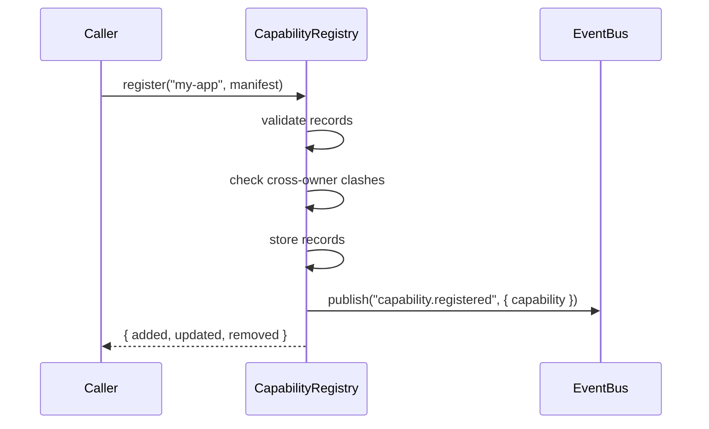

# FLOW: Capability Registry

## Status

- Type: End-to-end behavior and flow document
- Audience: Platform engineering, QA
- Scope: In-memory catalog that stores every capability offered by applications, runtime plugins, and the platform core, and serves read-only discovery of that catalog.
- PRD: [PRD-capability-registry.md](./PRD-capability-registry.md)
- TRD: [TRD-capability-registry.md](./TRD-capability-registry.md)

## Overview

A platform component (application, plugin, or platform core) calls the internal `register()` function with its full capability manifest. The registry validates each record, checks for cross-owner clashes, replaces that owner's previous catalog, emits `capability.*` events per changed record, and returns the diff. Any other component can then call `list()`, `search()`, or `describe()` to discover capabilities, or subscribe to `capability.*` events to track inventory changes.

---

## Flow 1: First Registration (Happy Path)

A new owner publishes their capability manifest for the first time.

### Trigger

An internal caller (e.g., an application's startup hook) calls `registry.register("my-app", manifest)`.

### Participants

- Caller (internal platform component)
- CapabilityRegistry
- EventBus

### Steps

1. Caller invokes `registry.register("my-app", { owner: "my-app", capabilities: [...] })`.
2. Registry validates each capability record: name format, non-empty version, valid type, non-empty description, owner match.
3. Registry checks for clashes: for each `(name, version)` in the new manifest, if any is already owned by a different owner, reject.
4. No clashes found. Registry stores all records under owner `"my-app"`.
5. Registry emits one `capability.registered` event per capability via `eventBus.publish("capability.registered", payload)`.
6. Registry returns `{ added: [...], updated: [], removed: [] }`.
7. Caller receives success response.

### Mermaid diagram

### Postconditions

- Catalog contains exactly the capabilities from the manifest, all owned by `"my-app"`.
- One `capability.registered` event was emitted per capability.
- No consumer received any `capability.updated` or `capability.removed` event.

---

## Flow 2: Replace / Re-register (Update Flow)

An existing owner publishes a new manifest that partially overlaps with their previous manifest.

### Trigger

A previously registered owner calls `registry.register("my-app", newManifest)` with a capability list that adds, removes, and updates entries.

### Steps

1. Caller invokes `registry.register("my-app", { owner: "my-app", capabilities: newList })`.
2. Registry validates all records in the new manifest (same checks as Flow 1).
3. Registry checks cross-owner clashes for new entries only.
4. Registry computes diff against existing records for `"my-app"`:
   - Records in `newList` but not in old list → added.
   - Records in old list but not in `newList` → removed.
   - Records in both lists with identical metadata → unchanged (no event).
   - Records in both lists with different metadata → updated.
5. Registry updates the store: removes old-only records, updates changed records, adds new records.
6. Registry emits events in registration order:
   - `capability.registered` for each added record.
   - `capability.updated` for each changed record (payload includes `previous` and `current`).
   - `capability.removed` for each removed record.
7. Registry returns `{ added: [...], updated: [...], removed: [...] }`.

### Postconditions

- Catalog contains exactly the capabilities from the new manifest for `"my-app"`.
- Old capabilities not in the new manifest are gone from the catalog.
- One event emitted per removed, added, or changed capability.
- No event emitted for unchanged capabilities.
- Unchanged records have the same reference identity (no unnecessary re-allocation).

---

## Flow 3: List (Read Flow)

A consumer wants a compact overview of all registered capabilities.

### Trigger

Any caller invokes `registry.list()`.

### Steps

1. Caller calls `registry.list()`.
2. Registry iterates all capabilities across all owners.
3. Registry returns `CapabilityCard[]` — each card has name, version, type, description.
4. The returned array is a new shallow copy; mutations to it do not affect the catalog.

### Postconditions

- Caller receives a snapshot of all capabilities at the time of the call.
- Catalog is not modified.

---

## Flow 4: Search (Read Flow)

A consumer searches capabilities by keyword.

### Trigger

Any caller invokes `registry.search(query)` with a non-empty query string.

### Steps

1. Caller calls `registry.search("customer")`.
2. Registry lowercases the query.
3. Registry iterates all capabilities, matching `name` or `description` against the query (case-insensitive substring match).
4. Registry returns matching capabilities as `CapabilityCard[]` in registration order (by owner order, then manifest order within each owner).

### Postconditions

- Caller receives matching subset of capabilities.
- Empty query returns empty array.
- Catalog is not modified.

---

## Flow 5: Describe (Read Flow)

A consumer requests full details of a specific capability.

### Trigger

Any caller invokes `registry.describe("customer.read")` or `registry.describe("customer.read", "1.0.0")`.

### Steps (with version specified):

1. Caller calls `registry.describe("customer.read", "1.0.0")`.
2. Registry looks up `(name="customer.read", version="1.0.0")` across all owners.
3. If found, returns `{ capability: <full record>, selectedVersion: "1.0.0", note: undefined }`.
4. If not found, returns `{ capability: null, selectedVersion: null }`.

### Steps (without version, single version exists):

1. Caller calls `registry.describe("customer.read")`.
2. Registry finds exactly one version of `"customer.read"`.
3. Returns `{ capability: <record>, selectedVersion: "1.0.0" }`.

### Steps (without version, multiple versions exist):

1. Caller calls `registry.describe("customer.read")`.
2. Registry finds multiple versions: `"1.0.0"`, `"2.0.0"`, `"1.5.0"`.
3. Registry selects latest by string comparison: `"2.0.0"`.
4. Returns `{ capability: <v2 record>, selectedVersion: "2.0.0", note: "auto-selected version 2.0.0 from 3 available" }`.

### Postconditions

- Caller receives full record or null.
- Catalog is not modified.
- When multiple versions exist, the response clearly indicates which version was returned and why.

---

## Flow 6: Clash Rejection (Error Flow)

A new owner tries to register a `(name, version)` combo already claimed by a different owner.

### Trigger

Owner `"app-b"` calls `registry.register("app-b", manifest)` where one capability `("customer.read", "1.0.0")` is already owned by `"app-a"`.

### Steps

1. Registry validates records — all pass format checks.
2. Registry checks each `(name, version)` against the global index.
3. Clash detected: `("customer.read", "1.0.0")` belongs to `"app-a"`, not `"app-b"`.
4. Registry rejects the entire register call.
5. No records from this manifest are stored.
6. No `capability.*` events are emitted.
7. Registry throws/returns an error: `"Clash on customer.read@1.0.0: already owned by app-a"`.

### Recovery

The caller must either:
- Change the version of their clashing capability.
- Rename their clashing capability.
- Coordinate with the existing owner to resolve the conflict.

---

## Flow 7: Validation Failure (Error Flow)

A caller submits a manifest with a malformed capability record.

### Trigger

A caller calls `registry.register("my-app", manifest)` where one capability is missing its name, has an invalid type, or has an empty description.

### Steps

1. Registry iterates records and validates each.
2. First invalid record encountered → validation fails.
3. Registry rejects the entire register call.
4. No records from this manifest are stored.
5. No `capability.*` events are emitted.
6. Registry returns an error describing the first validation failure.

### Recovery

Caller fixes the malformed record and re-submits the full manifest.

---

## Manual QA Checklist

### Setup

- [ ] `npm run build` passes for `@platform/capability-registry`
- [ ] `npm test` passes for both event-bus and capability-registry
- [ ] No lint or typecheck errors

### Register — first time

- [ ] Call `register("app-a", manifest)` with 3 valid capabilities → returns `{ added: [3], updated: [], removed: [] }` [AC-1]
- [ ] `list()` returns 3 cards [AC-5]
- [ ] `describe("cap.1", "1.0")` returns full record [AC-8]

### Register — replace/update

- [ ] Call `register("app-a", manifest)` with 2 new + 1 removed + 1 unchanged → events emitted for exactly 3 (not 4) [AC-10, AC-11, AC-12, AC-14]
- [ ] Removed capability no longer appears in `list()` [AC-16]

### Clash rejection

- [ ] `register("app-b", [{ name: "cap.1", version: "1.0", ... }])` fails with clash error [AC-3]
- [ ] Catalog unchanged after failed clash attempt [AC-3]
- [ ] No `capability.*` event emitted for failed attempt [AC-15]

### Validation rejection

- [ ] Manifest with missing name rejected [AC-4]
- [ ] Manifest with invalid type rejected [AC-4]
- [ ] Manifest with empty description rejected [AC-4]
- [ ] Catalog unchanged after validation failure [AC-4]

### Describe — version resolution

- [ ] `describe("cap.1")` with single version returns that version [AC-8]
- [ ] `describe("cap.1")` with multiple versions returns latest + note [AC-9]
- [ ] `describe("cap.1", "1.0")` returns exact version [AC-10]
- [ ] `describe("nonexistent", ...)` returns null [AC-10]

### Search

- [ ] `search("customer")` matches name and description case-insensitively [AC-7]
- [ ] `search("")` returns empty array [AC-7]

### Immutability

- [ ] Mutating a returned card from `list()` does not affect catalog [AC-6]
- [ ] Mutating a returned record from `describe()` does not affect catalog [AC-6]

### Cleanup / teardown

- [ ] No state leaks between test cases
