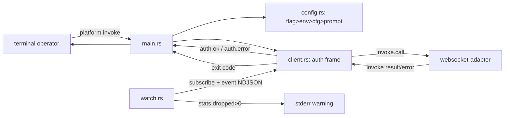

# PRD-TRD: CLI Adapter (`platform`)

**Slug:** cli-adapter
**Status:** Draft
**Date:** 2026-08-03

## Why This Exists

The Gateway's doors today are the MCP adapter (port 7100, request/response) and the
WebSocket adapter (port 7300, push+pull — pipeline Approved 2026-08-03, delivery in
flight). Both serve programs, not people. The operator
has no first-party way to ask "what capabilities are registered?", "what sessions are
live?", or "is the gateway healthy?" from a terminal — and no way to script those answers.

`platform` is that door: a single static Rust binary that reads AND writes through the one
locked wire (websocket-adapter W1–W6), with no business logic of its own — an adapter, not
an application. Without it, every operator hand-builds a WS client, re-implements auth and
exit-code conventions, and the adapters' "one door for all v1 clients" promise is quietly
untrue.

## Behavioral Spec

All behavior below is locked in wayfinder tickets Q1–Q5 (map.md, GRILL-cli-adapter.txt)
and demonstrated in the pre-impl sim (`simulate-pre.html`). The wire it rides is
websocket-adapter W1–W6 verbatim — no re-grilling.

### Scenario 1: Config precedence

**Given** sources in order flag > env > config file > prompt (TTY only)
**When** `platform` resolves the gateway URL and token
**Then** the first source that supplies a value wins: `--url`/`--token` flags, then
`PLATFORM_GATEWAY_URL`/`PLATFORM_TOKEN` env, then `<OS-config-dir>/platform/config.toml`
(override the default path with `--config <path>` — test/CI use), v1 schema:
`gateway_url` + `token` only; unknown keys IGNORED, then an interactive
prompt (token read with no echo) — available only when stdin is a TTY. A token value of
`path:/...` reads the file contents as the token, from ANY source, once per run. No
hardcoded default URL in v1. Missing URL+token with no TTY → exit 2.

### Scenario 2: Alias commands

**Given** an authenticated connection
**When** the operator runs a convenience alias
**Then** it maps to a capability invoke: `capabilities` → `capability.list`,
`sessions` → `session.list`, `plugins` → `plugin.list`, `status` → `gateway.status`,
`health` → `system.health`. Aliases are additive — no alias is removed without a
preceding deprecation note (Q2 lock).

### Scenario 3: Output shaping

**Given** a completed invoke
**When** stdout is a TTY
**Then** aliases render tables (`capabilities` = name/version/tier, `sessions` =
id/status/created, `plugins` = id/version/status), `status`/`health` render key:value,
and `platform invoke <cap>` renders pretty JSON.
**When** stdout is piped (non-TTY), or `--json` is passed
**Then** everything renders compact JSON on one line — script-safe.

### Scenario 4: Invoke with arguments

**Given** an authenticated connection
**When** the operator runs `platform invoke <capability> [--args '<json>'] [--session <id>]`
**Then** the frame is `{type:"invoke", correlationId, name, input?, sessionId?, mode:"call"}`
and the response maps to the terminal: `invoke.result` → output (exit 0); `invoke.error`
→ `error: <code> — <message>` with the gateway/capability code passed through verbatim
(no third vocabulary), exit 1.

### Scenario 5: Exit codes

**Given** any run
**Then** exit codes are: 0 = `invoke.result`; 1 = `invoke.error` (any `GATEWAY_*` code);
2 = pre-flight/connection failure (missing config, token unparseable, connect refused,
close 1009/1011, `subscribe.error`, `error` frame); 3 = TLS/upgrade failure; 4 =
`auth.error` before `auth.ok` (close 1008 — all W2 auth codes except `origin mismatch`;
the CLI never sends Origin); 5 = interrupted (Ctrl-C).

### Scenario 6: Token hygiene

**Given** config file present with perms looser than 0600
**When** a run starts and the config source actually supplies the token or URL
**Then** exactly ONE stderr warning (`config.toml is group/world-readable — consider
chmod 600`) per run. `path:` token files follow the same 0600 rule for the warning
(PRD-level refinement beyond the Q3 lock — security-positive; confirm at IMPL); a
missing `path:` file → error + exit 2.

### Scenario 7: Watch

**Given** an authenticated connection and `--watch` on one of the five aliases
**Then** the CLI invokes the snapshot once, subscribes to the alias's default topic
(`sessions` → `session.*`, `plugins` → `plugin.*`, `capabilities` → `capability.*`,
`status`/`health` → `gateway.*` — NOT `system.*`; no producers exist there per D3),
then prints `{type:"event",...}` frames as NDJSON (one per line) until Ctrl-C. Snapshot
prints in the normal TTY/`--json` shape; events never re-render it. `--topic <pattern>`
overrides the default. `--watch --json` = pure JSON stream (compact snapshot + NDJSON
events). A `stats` frame with `dropped > 0` → one stderr warning. Ctrl-C → exit 5.
No reconnect in v1.

### Scenario 8: Failure surfaces

**Given** a run that cannot complete
**Then** errors print to stderr as `error: <plain-English message>` and the exit code
distinguishes the layer: TLS (3) vs auth (4) vs connection/pre-flight (2) vs capability
denial or failure (1). Unreachable gateway, close codes 1009 (frame too large) and 1011
(heartbeat) are pre-flight/connection failures (exit 2).

## Simulation Contract

Post-impl sim must drive the REAL `platform` binary (statically linked, `crates/cli-adapter/`)
against a live gateway + websocket adapter and demonstrate:

```bash
platform capabilities                          # S2/S3: table, exit 0
platform sessions --json                       # S3: compact JSON
platform invoke gateway.status                 # S3: pretty JSON
platform invoke session.create --args '{}'     # S4: invoke.error passthrough, exit 1 (scope)
platform --token token.bad sessions            # S5: auth.error, close 1008, exit 4
platform --token path:/tmp/nope.jwt status     # S1/S6: missing file, exit 2
platform status --watch                        # S7: snapshot + NDJSON; Ctrl-C → exit 5
platform sessions --watch --json               # S7: pure JSON stream
# no env/config, non-TTY stdin                 → exit 2 (no default URL)     # S1
# wss:// with untrusted cert                    → exit 3                      # S5
# config.toml 0644                              → one stderr warning          # S6
```

Each behavioral scenario maps 1:1 to sim commands; the sim asserts the same observable
states the pre-impl sim showed (exit codes, tables/JSON shapes, wire frames, NDJSON
events).

## Technical Design

### Data Models

```rust
// Config resolution (Q3) — first source that supplies a value wins
struct ResolvedConfig { url: String, token: String, token_source: Source, url_source: Source }
enum Source { Flag, Env, ConfigFile, Prompt }

// Exit codes (Q4)
enum ExitCode { Ok=0, InvokeError=1, Preflight=2, Tls=3, Auth=4, Interrupted=5 }

// Config file v1 — unknown keys IGNORED (serde deny_unknown_fields OFF)
#[derive(Deserialize, Default)]
struct ConfigFile { gateway_url: Option<String>, token: Option<String> }
```

### API Contracts

Binary surface: `platform <alias|invoke> [flags]`. Flags: `--url <ws://host/ws>`,
`--token <jwt|path:/...>`, `--config <path>`, `--args '<json>'`, `--session <id>`,
`--json`, `--watch`, `--topic <pattern>`, `--help`, `--version`. Env: `PLATFORM_GATEWAY_URL`,
`PLATFORM_TOKEN`. Config path: `dirs::config_dir()/platform/config.toml`.

Wire frames (locked W4, verbatim): C→S `{type:"auth", token}`, `{type:"invoke",
correlationId, name, input?, sessionId?, mode:"call"}`, `{type:"subscribe", topics}`;
S→C `{type:"auth.ok"|"auth.error",...}`, `{type:"invoke.result", correlationId, output}`,
`{type:"invoke.error", correlationId, code, message, details?}`, `{type:"event", topic,
id, publishedAt, payload}`, `{type:"stats", dropped}`.

### Dependencies

- `tungstenite` — sync WebSocket client (no async runtime in v1; delay-complexity).
  TLS via its `rustls` feature for `wss://`; handshake errors → exit 3.
- `serde` + `serde_json` — frames + output.
- `dirs` — `<OS-config-dir>/platform/config.toml`.
- `rpassword` — no-echo token prompt (TTY only).
- `toml` — config file read (unknown keys ignored).
- `ctrlc` — SIGINT flag for watch mode.
- `std::io::IsTerminal` — TTY detection (no extra dep).

Versions pinned at scaffold time; opensrc verification for each during IMPL Phase A.
Rust edition 2021, static-ish release profile (musl target optional at build time, not a
v1 lock).

### Architecture Notes

Module layout: `src/main.rs` (arg parse + dispatch), `src/config.rs` (precedence
resolution, `path:` indirection, perms warning), `src/client.rs` (connect → auth →
invoke/subscribe → read loop), `src/output.rs` (table/pretty/compact formatters),
`src/watch.rs` (snapshot + subscribe + NDJSON loop + Ctrl-C flag), `src/errors.rs`
(exit-code mapping).



Crate lives at `agentide/crates/cli-adapter/` (new top-level dir, Q5); standalone crate,
no Cargo workspace in v1. `scripts/precommit-rust.sh` (fmt + clippy `-D warnings` + test;
skip with warning if no cargo) chains after `npm run build` in the root precommit. No CI
in v1.

## Non-Goals

- CLI never writes `config.toml` (operator hand-writes it; docs show the example).
- No reconnect or watch-resume in v1 (watch dies with the connection).
- No `--stream` (invoke streaming mode) in v1.
- No hardcoded default URL in v1 (missing config → hard fail, exit 2).
- No interactive shell / REPL; one command per process.
- No profiles or unknown config keys (ignored, per v1 schema).
- No token minting, refresh, or `path:` write-back.

## Out of Scope (Future)

Profiles (`[profiles]` table), default-URL revisit with docs, watch reconnect + resync,
`--stream`, `platform config set`, shell completions — tracked in
`docs/wayfinder/cli-adapter/future.md`.

## References

- `GRILL-cli-adapter.txt` — locked decisions Q1–Q5
- `docs/wayfinder/cli-adapter/map.md` + tickets — chart source
- `docs/wayfinder/cli-adapter/future.md` — deferred items
- `simulate-pre.html` — pre-impl design-time sim (approved gate)
- `PRD-TRD-websocket-adapter.md` — wire contract W1–W6 (verbatim, no re-grilling)
- `CONTEXT.md` — glossary
- `IMPL-cli-adapter.md` — execution plan (separate doc)
- `crates/cli-adapter/` — implementation (after IMPL phase)
