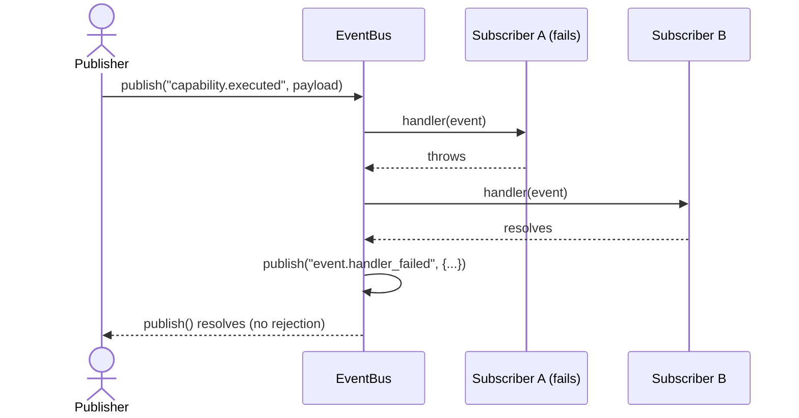

# FLOW: Event Bus

## Status

- Type: End-to-end behavior and flow document
- Audience: Product, engineering, QA
- Scope: In-process, typed publish/subscribe event delivery mechanism for the platform's
  Control Plane and Execution Plane components — no consumers required yet.
- PRD: [PRD-event-bus.md](./PRD-event-bus.md)
- TRD: [TRD-event-bus.md](./TRD-event-bus.md)

## Overview

Event Bus isn't a CRUD feature, so the flow slots below are adapted: "Add/Create" maps to
subscribing, "Retrieve/Use" maps to receiving events (including wildcard delivery over time),
and "Update/Refresh" maps to unsubscribing — the closest lifecycle transition an existing
subscription has. Every flow below is driven entirely by two calls (`publish`, `subscribe`)
and one returned handle (`Subscription.unsubscribe`).

---

## Flow 1: Primary Happy Path

A single subscriber registers for an exact event name; a publisher later publishes that
event; the subscriber's handler is called exactly once.

### Trigger

A component calls `subscribe('session.created', handler)`, then some time later another
component calls `publish('session.created', payload)`.

### Steps

1. Subscriber calls `subscribe('session.created', handler)` and receives a `Subscription`.
2. Publisher calls `publish('session.created', { sessionId: 'abc123' })`.
3. EventBus constructs a `PlatformEvent` — assigns `id`, `publishedAt`, and shallow-freezes
   the payload.
4. EventBus finds the one subscription whose pattern exactly matches `session.created`.
5. EventBus calls the subscriber's handler with the `PlatformEvent`.
6. Handler completes without error.
7. `publish()` resolves.

### Postconditions

The handler was called exactly once with the correct `PlatformEvent`. `publish()` resolved
without error. No `event.handler_failed` was published.

---

## Flow 2: Add / Create Flow (Subscribing)

### Trigger

A component wants to start receiving events under a specific name or namespace.

### Steps

1. Component calls `subscribe(pattern, handler)` — `pattern` is either an exact event name
   (`session.created`) or a wildcard ending in `*` (`browser.*`).
2. EventBus validates the pattern: non-empty, and if it contains `*`, that `*` must be the
   final character. A malformed pattern throws synchronously (see Flow 6).
3. EventBus registers the pattern + handler internally.
4. EventBus returns a `Subscription` object exposing `unsubscribe()`.

### Postconditions

The subscription is active for any future matching `publish()` call. Events published
*before* this call are never delivered retroactively — there is no replay.

---

## Flow 3: Retrieve / Use Flow (Wildcard delivery over time)

### Trigger

A subscriber has registered a wildcard pattern, and multiple different events are published
under and outside that namespace over time.

### Steps

1. Subscriber calls `subscribe('browser.*', handler)`.
2. Publisher A calls `publish('browser.started', {...})` — handler is invoked.
3. Publisher B calls `publish('browser.navigation.completed', {...})` — handler is invoked
   again (multi-segment names under the same prefix still match).
4. Publisher C calls `publish('session.created', {...})` — handler is **not** invoked; it
   falls outside the `browser.` namespace.

### Postconditions

The handler received exactly the two `browser.*` events, each with its own distinct
`PlatformEvent`, and was never called for the unrelated `session.created` event.

---

## Flow 4: Update / Refresh Flow (Unsubscribing)

### Trigger

A component that previously subscribed — most commonly a session that's ending — needs to
stop receiving events.

### Steps

1. Component holds the `Subscription` returned from an earlier `subscribe()` call.
2. Component calls `subscription.unsubscribe()`.
3. EventBus removes that subscription from its internal registry.
4. A later `publish()` call for a matching event name no longer invokes this handler.
5. Calling `unsubscribe()` a second time is a no-op — it does not throw.

### Postconditions

The handler is never invoked again after `unsubscribe()`. Double-unsubscribe is safe.

---

## Flow 5: Error / Fallback Flow

A subscriber's handler throws or rejects while processing an event; delivery to other
subscribers is unaffected, and the failure is surfaced rather than silently dropped.

### Trigger

`publish()` is called for an event with two matching subscribers, and the first one's handler
throws synchronously.

### Steps

1. Publisher calls `publish('capability.executed', payload)`.
2. EventBus finds two matching subscriptions: Subscriber A (e.g. a Logger) and Subscriber B
   (e.g. Analytics).
3. EventBus calls Subscriber A's handler — it throws synchronously.
4. EventBus catches the error internally. It is never propagated to the `publish()` caller.
5. EventBus calls Subscriber B's handler — it completes normally, entirely unaffected by A's
   failure.
6. EventBus publishes a follow-up `event.handler_failed` event with payload
   `{ eventName: 'capability.executed', subscriberPattern: <A's pattern>, error }`.
7. Any subscriber to `event.handler_failed` (if one exists) is notified, following the same
   delivery path as any other event.
8. The original `publish('capability.executed', ...)` call resolves normally — it does not
   reject — once A, B, and the internal `event.handler_failed` dispatch have all settled.

### Mermaid diagram

### Recovery

There is no automatic retry or redelivery to Subscriber A — per the PRD's non-goals, the
platform's response to a handler failure is observability, not correction.
`event.handler_failed` is the mechanism by which a human or a monitoring component (a future
Logger or Dashboard) finds out and investigates; the Event Bus itself takes no corrective
action.

---

## Flow 6: Additional Edge Case Flows

**6a. Publish with zero matching subscribers.** `publish()` still resolves normally — this is
a no-op, not an error.

**6b. Malformed wildcard pattern.** `subscribe('br*wser.started', handler)` — `*` appears
somewhere other than the final character. `subscribe()` throws synchronously at registration
time rather than silently treating it as a literal string.

**6c. Re-entrant unsubscribe.** A handler calls its own `subscription.unsubscribe()` while
it's being invoked, mid-dispatch, for the event currently being published. `publish()`
iterates a **snapshot** of matching subscriptions taken at the start of the call, not a live,
mutable list — so this does not crash or skip/duplicate delivery to other subscribers in the
same `publish()` call.

**6d. A subscriber to `event.handler_failed` itself throws.** Per the TRD's recursion guard,
this is caught and dropped (not re-published as another `event.handler_failed`) — this
prevents an infinite failure loop.

**6e. Overlapping patterns.** A subscriber to `browser.*` and a separate subscriber to the
exact name `browser.started` are both registered. When `browser.started` is published, both
receive it independently — there is no "most specific pattern wins" precedence. All matching
subscriptions fire, always.

---

## Manual QA Checklist

### Setup

- [x] `packages/event-bus` is built (`npm run build`) and importable
- [x] Each test scenario uses a fresh `EventBus` instance — no shared state carried between
      scenarios

### Happy path

- [x] Subscribe to an exact event name, publish that event, handler receives it exactly once
      [AC-2]
- [x] `publish()` resolves only after the handler has completed [AC-1]
- [x] Subscribe to a wildcard pattern, publish a matching multi-segment event name, handler
      receives it [AC-3]
- [x] Subscribe to a wildcard pattern, publish an unrelated event name, handler does not
      receive it [AC-3]

### Error handling

- [x] One handler throws synchronously; a second subscriber to the same event still receives
      it [AC-4]
- [x] One handler's returned promise rejects; a second subscriber to the same event still
      receives it [AC-4]
- [x] A handler failure triggers `event.handler_failed` with the correct `eventName`,
      `subscriberPattern`, and `error.message` [AC-5]
- [x] `publish()` itself never rejects, even when a subscriber's handler fails [AC-1, AC-4]

### Edge cases

- [x] Publishing with zero matching subscribers resolves normally, no error
- [x] Subscribing with a malformed pattern (`*` not as the final character) throws
      synchronously at `subscribe()` time
- [x] Calling `unsubscribe()` twice on the same `Subscription` does not throw
- [x] A handler that calls its own `unsubscribe()` mid-dispatch does not crash the current
      `publish()` call or affect delivery to other subscribers
- [x] A subscriber to `event.handler_failed` that itself throws does not cause infinite
      recursion or an unhandled rejection
- [x] Two overlapping subscriptions (exact + wildcard) both fire independently for a matching
      event
- [x] Published payload is frozen — mutating it inside a handler does not affect what other
      subscribers receive [AC-6]

### Cleanup / teardown

- [x] No lingering subscriptions or timers after the test suite completes — `EventBus`
      instances are per-test and hold no global state to reset
