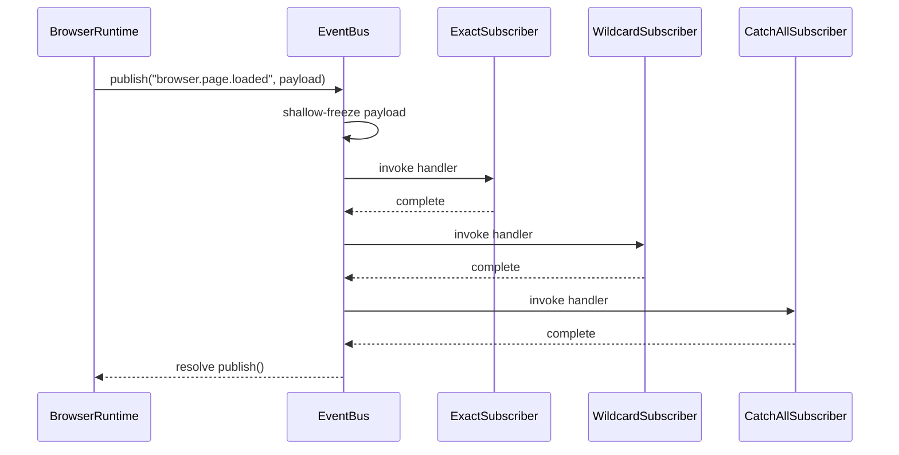
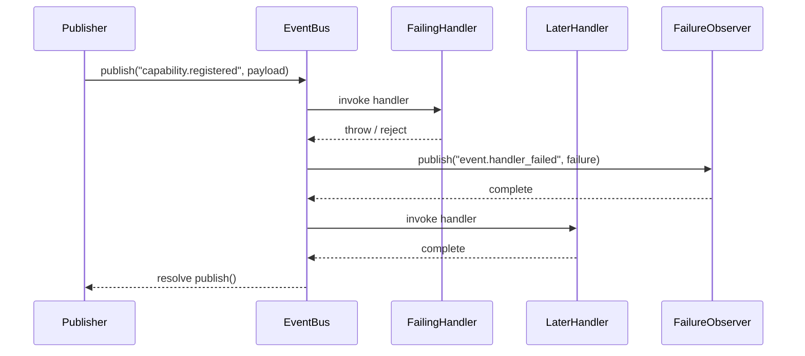

# FLOW: Event Bus

## Status

- Type: End-to-end behavior and flow document
- Audience: Product, engineering, QA
- Scope: In-process publish/subscribe behavior for the first platform Event Bus package.
- PRD: [PRD-event-bus.md](./PRD-event-bus.md)
- TRD: [TRD-event-bus.md](./TRD-event-bus.md)

## Overview

The Event Bus starts when a platform component subscribes to an event name or
wildcard pattern, then another component publishes an immutable event into the
same bus instance. The flow ends when every matching handler has been invoked,
all async handlers have settled, any failures have been surfaced through
`event.handler_failed`, and the caller receives a successful `publish()`
completion.

---

## Flow 1: Primary Happy Path

Specific and wildcard subscribers observe one published event in deterministic
registration order.

### Trigger

A platform component publishes an event like `browser.page.loaded` into a bus
instance that already has matching subscribers.

### Steps

1. Browser Runtime subscribes a handler to exact event
   `browser.page.loaded`.
2. Analytics Plugin subscribes a second handler to wildcard
   `browser.page.*`.
3. Gateway Logger subscribes a third handler to `**`.
4. Browser Runtime publishes `browser.page.loaded` with payload
   `{ url, tabId }`.
5. Event Bus shallow-freezes payload before dispatch.
6. Event Bus finds all matching handlers in registration order.
7. Event Bus invokes exact subscriber first, single-segment wildcard
   subscriber second, and catch-all subscriber third.
8. Each handler reads same payload values.
9. `publish()` completes after all invoked handlers settle.

### Mermaid diagram

### Postconditions

- Every matching handler runs once.
- Handler invocation order matches subscription order.
- Publisher sees successful completion after dispatch finishes.
- Payload remains unchanged for all subscribers.

---

## Flow 2: Add / Create Flow

New subscriptions enter system and begin observing later events only.

### Trigger

A component adds a new event subscription.

### Steps

1. Session Manager creates a bus instance for current runtime context.
2. Debugger Plugin subscribes to `session.created`.
3. Analytics Plugin subscribes to `browser.*`.
4. Event Bus stores each subscription with insertion order preserved.
5. Event Bus returns one unsubscribe handle per subscription.
6. No historical events are replayed to either new subscriber.
7. Later publishes are matched against stored subscriptions only from that
   point onward.

### Postconditions

- New subscriber receives future matching events only.
- Caller holds unsubscribe handle needed for later cleanup.
- Bus instance state remains local to that one Event Bus.

---

## Flow 3: Retrieve / Use Flow

A component gets value from previously-created subscriptions by receiving
matching future events.

### Trigger

A component that already subscribed with `browser.*` waits for browser-related
events from another component.

### Steps

1. Analytics Plugin keeps active subscription on `browser.*`.
2. Browser Runtime publishes `browser.started`.
3. Event Bus matches `browser.started` to `browser.*`.
4. Event Bus invokes Analytics Plugin handler.
5. Browser Runtime later publishes `browser.page.loaded`.
6. Event Bus does not match `browser.page.loaded` to `browser.*` because
   `*` covers exactly one segment.
7. A catch-all `**` subscriber, if present, still receives both events.

### Postconditions

- Single-segment wildcard behavior is observable and predictable.
- Subscriber sees only events that fit its pattern.
- Catch-all subscribers can observe whole system traffic.

---

## Flow 4: Update / Refresh / Version Flow

Subscriptions change over time through unsubscribe and later publishes reflect
that updated subscription set.

### Trigger

A component cleans up a subscription after its scope ends.

### Steps

1. Session Manager stores unsubscribe handle returned at subscribe time.
2. Session-scoped work ends.
3. Session Manager calls unsubscribe handle.
4. Event Bus removes that subscription from future matching.
5. Another component publishes same event again.
6. Removed subscriber no longer receives delivery.
7. If unsubscribe is called from inside an in-flight handler, Event Bus keeps
   current dispatch snapshot intact and applies removal only to later
   publishes.

### Postconditions

- Cleanup removes future deliveries for that subscription.
- In-flight dispatch remains stable even if a handler unsubscribes itself.
- Session-owned resource cleanup stays outside Event Bus internals.

---

## Flow 5: Error / Fallback Flow

One handler fails but remaining handlers still run and publisher still gets a
successful completion.

### Trigger

At least one matching handler throws or returns a rejected promise during
dispatch.

### Steps

1. Capability Registry publishes `capability.registered`.
2. First matching handler throws or rejects.
3. Event Bus captures failure details.
4. Event Bus emits one internal `event.handler_failed` event with original
   event, failing handler index, and error.
5. Event Bus continues invoking later matching handlers in the same dispatch.
6. All remaining sync and async handlers settle.
7. Original `publish()` resolves successfully rather than rejecting.

### Mermaid diagram

### Recovery

Operator or observability tooling inspects `event.handler_failed`, fixes noisy
subscriber, and leaves healthy subscribers running. No rollback is needed
because Event Bus does not persist partial state.

---

## Flow 6: Edge Case Flows

Additional behavior that constrains the package boundary and replacement-safe
semantics.

### Trigger

A caller exercises one of the boundary cases below.

### Steps

1. Two separate Event Bus instances are created.
2. Publisher sends event into bus A.
3. Subscribers on bus B receive nothing.
4. Mixed sync and async handlers subscribe on same bus.
5. Event Bus invokes them in registration order; async completion order may
   differ, but `publish()` waits for all of them.
6. External caller attempts to publish `event.handler_failed` directly.
7. Event Bus rejects that publish path because `event.*` is reserved for
   bus-internal events only.
8. Publisher attempts to mutate payload after publish or subscriber attempts to
   mutate inside handler.
9. Mutation does not change values seen by other handlers because payload was
   shallow-frozen before dispatch.

### Postconditions

- Bus instances stay isolated.
- Invocation order remains deterministic across mixed handler types.
- Internal namespace boundary is observable.
- Published payload stays shallowly immutable.

---

## Manual QA Checklist

Executable steps for a human reviewer. Each item references PRD acceptance
criteria in listed order.

### Setup

- [ ] Create one Event Bus instance with three subscribers: exact match,
      `browser.*`, and `**`.
- [ ] Create a second separate Event Bus instance with one subscriber to prove
      instance isolation.
- [ ] Prepare one sync handler, one async handler, one throwing handler, and
      one rejecting async handler.

### Happy path

- [ ] Publish `browser.page.loaded` and confirm every matching handler runs
      exactly once. [AC-1]
- [ ] Publish `browser.started` and confirm `browser.*` matches it but not
      `browser.page.loaded`. [AC-2]
- [ ] Publish several event names at different depths and confirm `**`
      receives all of them. [AC-3]
- [ ] Register handlers in known order and confirm delivery order stays same
      across repeated publishes. [AC-4]
- [ ] Mix sync and async subscribers, then confirm invocation order follows
      registration order even if completion order differs. [AC-5]
- [ ] Add one async handler with visible delay and confirm `publish()`
      completes only after it settles. [AC-6]
- [ ] Attempt payload mutation in publisher or subscriber and confirm later
      handlers still see original shallow values. [AC-12]
- [ ] Review public TypeScript event payload declarations and confirm payload
      properties are marked `readonly` by convention. [AC-13]

### Error handling

- [ ] Make first handler throw and confirm later handlers still run. [AC-7]
- [ ] Make async handler reject and confirm later handlers still run. [AC-8]
- [ ] Confirm thrown or rejected handlers do not cause original `publish()`
      to reject. [AC-9]
- [ ] Confirm mixed async failures still end with successfully-resolved
      `publish()` after all handlers settle. [AC-10]
- [ ] Confirm exactly one `event.handler_failed` event is emitted per failing
      handler and payload includes original event, handler index, and error.
      [AC-11]
- [ ] Attempt external publish into `event.*` and confirm Event Bus blocks it.
      [AC-16]

### Edge cases

- [ ] Call unsubscribe handle, publish again, and confirm removed subscriber no
      longer receives delivery. [AC-14]
- [ ] Unsubscribe from inside a running handler and confirm remaining handlers
      in that same dispatch still run. [AC-15]
- [ ] Publish into bus A and confirm subscribers on bus B receive nothing.
      [AC-17]

### Cleanup / teardown

- [ ] Call remaining unsubscribe handles and discard both bus instances.
- [ ] Clear any temporary logs or counters used to observe handler order and
      failure events.
