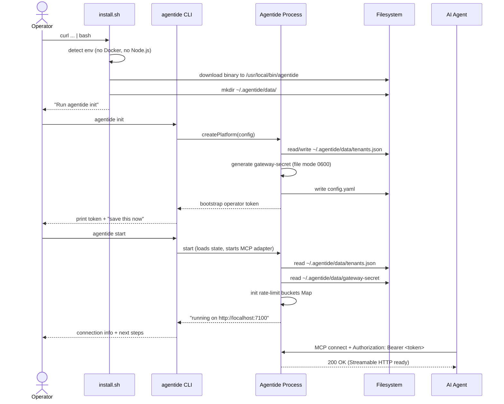
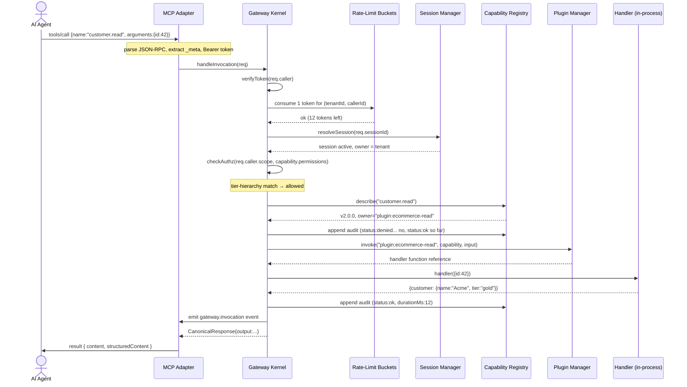
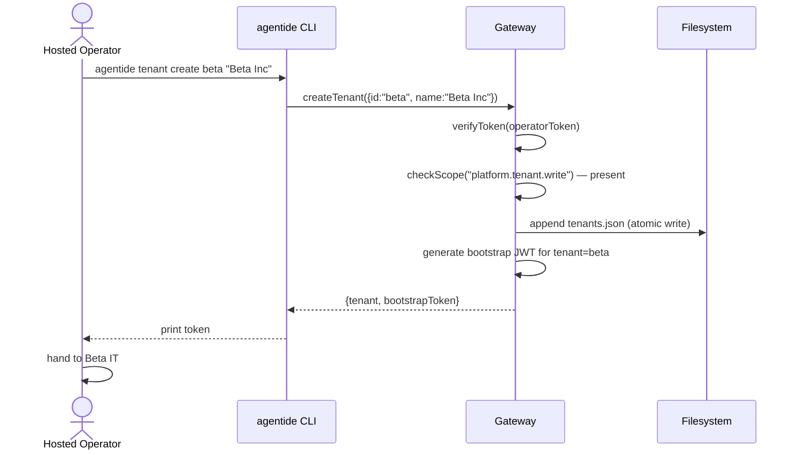
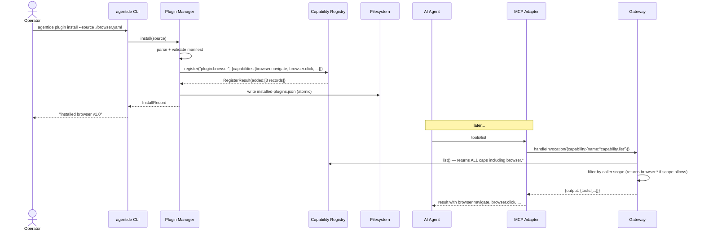

# FLOW: Gateway Core

## Status

- Type: End-to-end behavior and flow document
- Audience: Product, engineering, QA
- Scope: In-process control-plane component that authenticates callers, authorizes capability invocations, manages sessions, dispatches to capability handlers, audits every invocation, applies rate limits, and enforces tenant isolation. Ships with a default MCP adapter and an `agentide` CLI for operators.
- PRD: [PRD-gateway-core.md](./PRD-gateway-core.md)
- TRD: [TRD-gateway-core.md](./TRD-gateway-core.md)
- GRILL: [GRILL-gateway-core.txt](./GRILL-gateway-core.txt)

## Overview

A capability invocation enters the Gateway through one of N adapters (default: MCP Streamable HTTP on `localhost:7100`). The adapter translates the transport-specific request into the canonical `CanonicalInvocation` packet and hands it to the Gateway kernel's `handleInvocation()` function. The kernel performs authn → rate-limit → session check → authz → capability lookup → version resolve → dispatch, all in sequence, then returns a `CanonicalResponse`. Every step (success, denial, error) produces one audit log record and one `gateway.invocation` Event Bus event. Operators manage the platform via the `agentide` CLI; the platform itself never requires code to install or run.

---

## Flow 1: Operator Install + First Boot (Primary Happy Path)

The canonical "I just installed Agentide and want to use it" path. Covers install script, first-run bootstrap, platform boot, MCP readiness.

### Trigger

Operator runs `curl -fsSL https://agentide.io/install.sh | bash` on a clean Linux amd64 machine.

### Steps

1. Install script detects environment: `Linux x64, no Docker, no Node.js`.
2. Script downloads `agentide` single-executable (Node SEA bundle, ~12 MB) to `/usr/local/bin/agentide`.
3. Script creates `~/.agentide/data/` directory.
4. Script prints: "Run `agentide init` to bootstrap a tenant and operator token."
5. Operator runs `agentide init`.
6. CLI creates a `default` tenant (TenantRecord persisted to `~/.agentide/data/tenants.json`).
7. CLI generates a bootstrap operator JWT (HS256, signed with auto-generated secret in `~/.agentide/data/gateway-secret`).
8. CLI writes default `~/.agentide/config.yaml` (port 7100, dataDir, audit path, tenant path, MCP adapter enabled).
9. CLI prints the bootstrap token prominently + "save this now" warning.
10. Operator runs `agentide start`.
11. CLI composes Tier 1 components + gateway-core + MCP adapter via `createPlatform(config)`.
12. Gateway factory loads `tenants.json` from disk (1 tenant: `default`).
13. Gateway factory reads `gateway-secret` (auto-generated on first run).
14. Gateway factory creates in-memory rate-limit buckets Map (empty initially).
15. MCP adapter starts HTTP server on port 7100.
16. CLI prints "Agentide vX.Y.Z is running" + connection info.
17. AI agent connects via MCP at `http://localhost:7100`, presents `Authorization: Bearer <bootstrap-token>`.

### Mermaid diagram

### Postconditions

- `/usr/local/bin/agentide` (or `~/.local/bin/agentide`) is on PATH.
- `~/.agentide/data/` contains: `tenants.json`, `gateway-secret`, `audit.log`, `gateway-state.json`.
- One tenant (`default`) exists.
- One operator token is in the operator's clipboard (not persisted to disk).
- MCP adapter is listening on `localhost:7100` (Streamable HTTP).
- AI agent can connect and invoke capabilities.
- Audit log is empty (no invocations yet).

---

## Flow 2: Capability Invocation (Primary Happy Path — Most Common)

The most common run during the platform's life: an AI agent invokes a capability.

### Trigger

AI agent sends MCP `tools/call { name: "customer.read", arguments: { id: 42 } }` with `Authorization: Bearer <jwt>` and `_meta.dev.agentide/sessionId: "s_abc"`.

### Steps

1. MCP adapter receives the JSON-RPC request.
2. Adapter validates required `_meta.io.modelcontextprotocol/protocolVersion` and `clientCapabilities`. Missing → HTTP 400 / JSON-RPC `-32602` (Invalid params).
3. Adapter extracts `Authorization: Bearer <jwt>` and `_meta.dev.agentide/sessionId`.
4. Adapter calls `gateway.handleInvocation({caller, capability: {name: "customer.read"}, input: {id: 42}, sessionId: "s_abc"})`.
5. Gateway validates request shape (canonical packet has all required fields).
6. Gateway verifies the JWT (HS256 signature, `exp`, `iat`). Invalid → `GATEWAY_AUTH_FAILED`. Expired → `GATEWAY_TOKEN_EXPIRED`. Tampered → `GATEWAY_TOKEN_INVALID`.
7. Gateway consumes 1 token from the rate-limit bucket for `(tenantId, callerId)`. Empty → `GATEWAY_RATE_LIMIT_EXCEEDED` (`retryable: true`).
8. Gateway resolves `sessionId = "s_abc"` against the Session Manager. Session belongs to caller's tenant and exists in active status. Otherwise → `GATEWAY_SESSION_REQUIRED` or `GATEWAY_TENANT_MISMATCH`.
9. Gateway resolves capability version: `capabilityRegistry.describe("customer.read")` → returns v2.0.0 (latest).
10. Capability requires session check: `customer.read` is `runtime.*` (or `business.*` if owned by an SDK), session required. Session present → OK.
11. Gateway performs tier-hierarchy authz check. Caller's scope includes `customer.read` (or higher tier for `customer.read`'s permission). Otherwise → `GATEWAY_INSUFFICIENT_SCOPE`.
12. Gateway appends audit record (status: "denied" if any check above failed; we proceed assuming all passed).
13. Gateway dispatches based on `owner`:
    - If `owner = "plugin:browser"` → call Plugin Manager, which returns the runtime plugin's handler function. Call it directly in-process.
    - If `owner = "session-manager"` / `"plugin-manager"` / `"capability-registry"` → call the manager's method directly.
    - If `owner = "backend-sdk-ecommerce-app"` → forward to Backend Runtime, which sends over the persistent SDK connection. (Future pack; in v1 no SDK is connected, so this fails with `GATEWAY_SDK_UNREACHABLE`.)
14. Handler runs. Returns `{ customer: { name: "Acme", tier: "gold" } }`.
15. Handler completes within `config.handlerTimeoutMs` (default 30s). Otherwise → `GATEWAY_HANDLER_TIMEOUT` (tool error, `isError: true` in MCP response).
16. Gateway appends audit record (status: "ok", durationMs: 12).
17. Gateway emits `gateway.invocation` event on Event Bus.
18. Gateway returns `CanonicalResponse { output: { customer: {...} } }`.
19. MCP adapter wraps: `{ result: { content: [{type: "text", text: ...}], structuredContent: { customer: {...} } } }`.
20. AI agent receives the result.

### Mermaid diagram

### Postconditions

- Audit log has 1 new record (`status: "ok"`, `durationMs: ~12`).
- Event Bus received 1 `gateway.invocation` event.
- Rate-limit bucket for `(tenantId, callerId)` is 1 token lower.
- Agent received the result.

---

## Flow 3: Tenant Provisioning (Hosted Operator Action)

How a hosted platform operator onboards a new customer. In self-hosted, this flow is skipped (one auto-provisioned `default` tenant).

### Trigger

Hosted operator runs `agentide tenant create beta "Beta Inc"`.

### Steps

1. CLI calls `gateway.createTenant({id: "beta", name: "Beta Inc"})`.
2. Gateway validates the operator's own token (must have `platform.tenant.write` scope).
3. Gateway generates a tenant ID check (must be unique).
4. Gateway creates TenantRecord, persists to `~/.agentide/data/tenants.json` (atomic write).
5. Gateway generates a bootstrap operator token for tenant `beta` (caller = `beta-admin`, scope = `*`).
6. Gateway returns `{tenant, bootstrapToken}`.
7. CLI prints the token to the operator's terminal.
8. Operator hands the token to Beta's IT contact, who distributes to Beta's apps.
9. Beta's apps connect via MCP with their tenant-scoped token.
10. Beta's apps invoke capabilities scoped to `beta` tenant.

### Mermaid diagram

### Postconditions

- `tenants.json` has 1 new entry (in addition to `default`).
- Bootstrap token is in operator's clipboard; not persisted.
- Beta's apps can connect with this token; their invocations, audit records, sessions are all scoped to `beta`.

---

## Flow 4: Plugin Install → Capability Set Changes

A runtime plugin is installed; the capability catalog changes; subsequent `tools/list` returns the new capabilities.

### Trigger

Operator runs `agentide plugin install --source ./browser.yaml` (or invokes `plugin.install` capability).

### Steps

1. CLI calls `pluginManager.install(source)`.
2. Plugin Manager parses + validates the manifest.
3. Plugin Manager reads source file from disk.
4. Plugin Manager registers the plugin's capabilities with Capability Registry (`register("plugin:browser", {owner, capabilities})`).
5. Capability Registry emits `capability.registered` events for each new capability.
6. Plugin Manager persists install record to `installed-plugins.json`.
7. Plugin Manager emits `plugin.installed` event.
8. Plugin Manager returns the InstallRecord to the CLI.
9. CLI prints install confirmation.
10. Subsequent AI agent `tools/list` requests (via MCP) → Gateway → `capability.list` → returns capabilities INCLUDING the new plugin's capabilities (filtered by caller's scope).
11. Subsequent agent `tools/call {name: "browser.navigate", ...}` → Gateway → owner = "plugin:browser" → Plugin Manager → runtime handler.

### Mermaid diagram

### Postconditions

- New capabilities are visible in `tools/list` (subject to caller's scope).
- `installed-plugins.json` has 1 new entry.
- `plugin.installed` event published.
- New capabilities can be invoked via `tools/call`.

---

## Flow 5: Error / Fallback Flows

### Flow 5a: Invalid or missing auth token

**Trigger**: AI agent calls `tools/call` without `Authorization` header, or with an expired/tampered token.

**Steps**:
1. Adapter extracts `Authorization` header. Missing → `GATEWAY_AUTH_FAILED`.
2. Gateway verifies JWT. Invalid signature → `GATEWAY_TOKEN_INVALID`.
3. JWT signature OK but `exp` is past → `GATEWAY_TOKEN_EXPIRED`.
4. All paths → `CanonicalResponse { error: { code: "GATEWAY_AUTH_*", ... } }`.
5. Audit log appends `{status: "denied", denyReason: "GATEWAY_AUTH_FAILED", ...}`.
6. MCP adapter maps to JSON-RPC error `-32001` with `data: { code: "GATEWAY_AUTH_*", message, details, retryable: false }`.

**Recovery**: caller re-runs `agentide token issue` (with operator scope) to get a fresh token, or fixes the token. No platform state changes.

### Flow 5b: Rate limit exceeded

**Trigger**: caller has exhausted their token bucket (e.g., 100 successful invocations in a burst, refill rate exceeded).

**Steps**:
1. Gateway rate-limit check: bucket empty.
2. Return `{ error: { code: "GATEWAY_RATE_LIMIT_EXCEEDED", retryable: true, message: "rate limit exceeded for caller X" } }`.
3. NO dispatch happens.
4. Audit log appends `{status: "denied", denyReason: "GATEWAY_RATE_LIMIT_EXCEEDED", ...}`.

**Recovery**: caller waits for bucket refill (default 10/sec → next token available in 100ms) and retries. Long-term: issue a token with a higher rate-limit budget (configurable per-caller, deferred to TRD-level config knob).

### Flow 5c: Capability not found

**Trigger**: caller invokes `customer.read` but the capability was never registered.

**Steps**:
1. Gateway authn + authz pass.
2. `capabilityRegistry.describe("customer.read")` → returns `null`.
3. Return `{ error: { code: "GATEWAY_CAPABILITY_NOT_FOUND", details: {capability: "customer.read"}, retryable: false } }`.
4. Audit log appends `{status: "denied", denyReason: "GATEWAY_CAPABILITY_NOT_FOUND", ...}`.

**Recovery**: caller checks the capability name (typo fix), or operator runs `agentide capability list` to see what's available.

### Flow 5d: Insufficient scope

**Trigger**: caller's token scope doesn't include the capability's required permission.

**Steps**:
1. Gateway authn passes.
2. Tier-hierarchy check: caller's tier rank < capability's required rank.
3. Return `{ error: { code: "GATEWAY_INSUFFICIENT_SCOPE", details: { capability, requiredScope, callerScope, retryable: false } } }`.
4. Audit log appends `{status: "denied", denyReason: "GATEWAY_INSUFFICIENT_SCOPE", ...}`.

**Recovery**: operator issues a new token with broader scope (`agentide token issue --scope "+runtime.browser.act"` to add the missing scope).

### Flow 5e: Plugin disabled

**Trigger**: caller invokes `browser.screenshot`, but the Browser Plugin was disabled via `plugin.disable`.

**Steps**:
1. Gateway authn + authz pass.
2. `capabilityRegistry.describe("browser.screenshot")` → returns the capability (registered).
3. Dispatch: owner = `plugin:browser`. Call Plugin Manager.
4. Plugin Manager checks InstallRecord.enabled — false.
5. Plugin Manager returns "plugin disabled" error.
6. Gateway translates to `{ error: { code: "GATEWAY_PLUGIN_DISABLED", details: {pluginId: "browser"}, retryable: false } }`.
7. Audit log appends `{status: "denied", denyReason: "GATEWAY_PLUGIN_DISABLED", ...}`.

**Recovery**: operator runs `plugin.enable browser` or `agentide plugin enable browser`.

### Flow 5f: Handler timeout

**Trigger**: handler takes longer than `config.handlerTimeoutMs` (default 30s).

**Steps**:
1. Gateway dispatches to handler.
2. Handler runs beyond timeout.
3. Timeout fires; handler's promise is rejected with timeout error.
4. Gateway translates to `{ error: { code: "GATEWAY_HANDLER_TIMEOUT", details: {capability, timeoutMs}, retryable: true } }`.
5. **Tool error**: MCP adapter wraps as `{ result: { content: [...], isError: true } }` (per MCP spec — LLM sees the error and self-corrects, not a transport error).
6. Audit log appends `{status: "error", errorCode: "GATEWAY_HANDLER_TIMEOUT", ...}`.

**Recovery**: handler author investigates why the call exceeded 30s. Caller may retry.

### Flow 5g: Cross-tenant attempt

**Trigger**: caller with tenant `beta` token attempts to resume a session belonging to tenant `acme`.

**Steps**:
1. Gateway extracts `tenantId: "beta"`, `callerId: "agent-1"` from token.
2. Gateway resolves session ID against Session Manager.
3. Session exists but belongs to tenant `acme`.
4. Return `{ error: { code: "GATEWAY_TENANT_MISMATCH", details: { sessionId, sessionTenant: "acme", callerTenant: "beta" }, retryable: false } }`.
5. Audit log appends `{status: "denied", denyReason: "GATEWAY_TENANT_MISMATCH", ...}`.

**Recovery**: caller is operating against wrong tenant. Fix: use a token for the correct tenant.

### Flow 5h: Backend SDK unreachable (future pack)

**Trigger**: business capability's owner is `backend-sdk-ecommerce-app`, but the SDK process is disconnected.

**Steps**:
1. Gateway authn + authz pass.
2. Dispatch: owner = `backend-sdk-ecommerce-app`. Forward to Backend Runtime.
3. Backend Runtime: SDK connection for that owner not found (process crashed, deploy in progress, never started).
4. Return `{ error: { code: "GATEWAY_SDK_UNREACHABLE", details: {owner}, retryable: true } }`.
5. Audit log appends `{status: "error", errorCode: "GATEWAY_SDK_UNREACHABLE", ...}`.

**Recovery**: SDK reconnects (auto-reconnect handled by Backend Runtime). Caller may retry. (In v1, no SDK ships; this flow is documented for the future pack.)

---

## Flow 6: Edge Cases

### Flow 6a: Capability version pinning

**Trigger**: caller specifies `{capability: {name: "customer.read", version: "1.0.0"}}` even though v2.0.0 is the latest.

**Steps**:
1. Gateway resolves via `capabilityRegistry.describe("customer.read", "1.0.0")` → returns v1.0.0.
2. If v1.0.0 is not registered → returns `GATEWAY_CAPABILITY_NOT_FOUND`.
3. Otherwise dispatches to v1.0.0's handler.
4. Audit log records `capability.version: "1.0.0"`.

**Postconditions**: v1.0.0 handler runs even though v2.0.0 is latest. Operator sees pinned version in audit.

### Flow 6b: Session not required (read-only discovery)

**Trigger**: agent invokes `capability.list` (no session required per Q3 split).

**Steps**:
1. Gateway authn + authz pass.
2. Session check skipped (capability.list is in the no-session-required set).
3. `capabilityRegistry.list()` returns all capabilities.
4. Filter by caller's scope.
5. Return.

**Postconditions**: agent sees discovery without needing a session.

### Flow 6c: Caller has no session but invokes session-required capability

**Trigger**: agent invokes `customer.read` without `sessionId` in `_meta`.

**Steps**:
1. Gateway authn + authz pass.
2. Session check: capability is session-required, but `req.sessionId` is undefined.
3. Return `{ error: { code: "GATEWAY_SESSION_REQUIRED", retryable: false } }`.
4. Audit log appends `{status: "denied", denyReason: "GATEWAY_SESSION_REQUIRED", ...}`.

**Recovery**: caller invokes `session.create` to get a `sessionId`, retries with that ID in `_meta`.

### Flow 6d: Operator restarts the platform (in-flight sessions)

**Trigger**: operator runs `agentide stop` while sessions are active. Then `agentide start`.

**Steps**:
1. `agentide stop` sends SIGTERM to the running process.
2. Process begins graceful shutdown: stops accepting new requests, waits for in-flight handlers to finish (max 30s grace period).
3. Audit log finalizes (flushed to disk).
4. Process exits.
5. Operator runs `agentide start`.
6. New process boots, loads state from disk (tenants.json, installed-plugins.json, gateway-secret).
7. **Sessions are NOT persisted** (in-memory only in v1). Active sessions are lost. Idle sessions that were suspended via Session Manager's idle timer remain suspended (Session Manager state may or may not be persisted — check Session Manager docs).
8. Agents must re-create sessions: invoke `session.create` again.

**Postconditions**: Tenants + plugins + audit log survive restart. Active sessions do NOT.

### Flow 6e: Token without scope claim

**Trigger**: malformed JWT (missing `scope` claim).

**Steps**:
1. Gateway verifies JWT signature.
2. Decoded payload has no `scope` field.
3. Treat as empty scope: caller has no permissions.
4. Any capability invocation → `GATEWAY_INSUFFICIENT_SCOPE`.

**Recovery**: re-issue the token via `agentide token issue --scope ...` (with at least one scope).

### Flow 6f: Tools list pagination

**Trigger**: capability catalog has more than the MCP page size (typically 100).

**Steps**:
1. MCP adapter receives `tools/list` with optional `cursor`.
2. Adapter calls `gateway.handleInvocation({capability: {name: "capability.list"}, input: {cursor}})`.
3. Gateway returns `{ tools: [...page...], nextCursor: "..." }`.
4. MCP adapter wraps as `{ result: { tools: [...], nextCursor: "..." } }` per MCP spec.
5. Client passes `cursor` on next call.

**Postconditions**: clients paginate correctly; total catalog surfaced over multiple calls.

---

## Manual QA Checklist

Executable steps for a human reviewer. Each item references the PRD acceptance criterion it covers.

### Setup

- [ ] Linux amd64 or arm64 test machine with curl, no Docker, no Node.js [AC-install-oneliner]
- [ ] Run `curl -fsSL https://agentide.io/install.sh | bash` and verify `/usr/local/bin/agentide` exists [AC-install-oneliner]
- [ ] Run `agentide init` and capture the bootstrap token from stdout [AC-init-bare-install]
- [ ] Run `agentide start` (foreground); in another terminal, verify `nc -z localhost 7100` returns OK [AC-start-mcp-port]
- [ ] Have an MCP client available (e.g., `npx @modelcontextprotocol/inspector`) [AC-mcp-tools-list]

### Happy path — install + first invocation

- [ ] `tools/list` with the bootstrap token returns ≥ 0 capabilities (at least `capability.list`, `gateway.status`, `session.create`) [AC-tools-list-bootstrap]
- [ ] `tools/call {name: "session.create", arguments: {}}` returns `{output: {sessionId: "s_..."}}` [AC-session-create]
- [ ] Subsequent `tools/call {name: "capability.list"}` with `_meta.dev.agentide/sessionId: <id>` succeeds (capability.list is session-less; check that it works without session too) [AC-capability-list-no-session]
- [ ] Audit log at `~/.agentide/data/audit.log` has one record per invocation; `tail -f` shows new lines as you call [AC-audit-one-record-per-invocation]
- [ ] Audit record contains `ts`, `caller.id`, `caller.scope`, `capability.name`, `owner`, `status`, `durationMs` [AC-audit-record-shape]

### Auth + token issuance

- [ ] `agentide token issue --tenant default --caller test-agent --scope "platform.session.create" --expires-in 1h` returns a JWT [AC-token-issue-success]
- [ ] Decoded JWT (paste into jwt.io) shows `sub: {tenantId, callerId}`, `scope: [...], exp, iat` [AC-token-claim-shape]
- [ ] Use this token in `Authorization: Bearer ...` on MCP; `tools/list` succeeds [AC-token-bearer-works]
- [ ] Tamper with the JWT signature (e.g., flip a byte); `tools/call` returns `GATEWAY_AUTH_FAILED` (via JSON-RPC `-32001` with structured `data.code`) [AC-tampered-jwt-rejected]
- [ ] Wait for `exp`; `tools/call` returns `GATEWAY_TOKEN_EXPIRED` [AC-expired-jwt-rejected]
- [ ] Omit `Authorization` header; `tools/call` returns `GATEWAY_AUTH_FAILED` [AC-missing-auth-rejected]

### Sessions

- [ ] `tools/call {name: "session.create"}` returns a `sessionId` [AC-session-create-success]
- [ ] `session.destroy` followed by `session.resume {sessionId: <destroyed>}` returns error [AC-session-destroy-blocks-resume]
- [ ] Capability that requires a session (`plugin.install`) called without `sessionId` returns `GATEWAY_SESSION_REQUIRED` [AC-session-required]
- [ ] `tools/list` and `gateway.status` work WITHOUT a `sessionId` [AC-discovery-no-session]

### Authz (tier hierarchy)

- [ ] Issue token with scope `runtime.browser.read`; invoke `browser.screenshot` (requires `runtime.browser.read`) → succeeds [AC-tier-read]
- [ ] Same token invokes `browser.evaluate` (requires `runtime.browser.act`) → returns `GATEWAY_INSUFFICIENT_SCOPE` [AC-tier-act-denied]
- [ ] Issue token with `runtime.browser.act`; same calls succeed (act covers read) [AC-tier-act-covers-read]
- [ ] Issue token with `runtime.browser.destructive`; same calls succeed; `browser.deleteCookies` (requires destructive) also succeeds [AC-tier-destructive-covers-act]
- [ ] Issue token with `platform.plugin.read` only; `plugin.install` returns `GATEWAY_INSUFFICIENT_SCOPE` [AC-platform-plugin-write-denied]
- [ ] `tools/list` with `runtime.browser.read` token returns `browser.screenshot` but NOT `browser.evaluate` or `browser.deleteCookies` [AC-tools-list-scope-filter]
- [ ] Business capability (`customer.read`, exact match); token with `customer.write` only returns `GATEWAY_INSUFFICIENT_SCOPE` (no tier coverage for business) [AC-business-exact-match]

### Dispatch

- [ ] Invoke a `plugin:*` capability (after installing a plugin); verify it's dispatched in-process (handler runs, response returned) [AC-dispatch-plugin]
- [ ] Invoke a `session.*` capability; verify it goes through the Session Manager [AC-dispatch-session-manager]
- [ ] Invoke a non-existent capability (e.g., `nonexistent.foo`); returns `GATEWAY_CAPABILITY_NOT_FOUND` (JSON-RPC `-32601`) [AC-capability-not-found]
- [ ] Disable a plugin via `agentide plugin disable <id>`; invoke its capability; returns `GATEWAY_PLUGIN_DISABLED` [AC-plugin-disabled]

### Audit

- [ ] Run 5 successful invocations; `audit.log` has 5 records [AC-audit-count]
- [ ] Each record has a unique `ts` (monotonic, roughly) [AC-audit-timestamp]
- [ ] `agentide logs` tails the audit log [AC-cli-logs]
- [ ] `agentide logs --follow` works like `tail -f` [AC-cli-logs-follow]

### Rate limit

- [ ] With default config (capacity 100, 10/sec), fire 110 requests rapidly [AC-rate-limit-default]
- [ ] First 100 succeed; remaining 10 return `GATEWAY_RATE_LIMIT_EXCEEDED` with `retryable: true` [AC-rate-limit-shape]
- [ ] Wait 1 second (10 tokens refilled); next call succeeds [AC-rate-limit-refill]
- [ ] Stop process, restart; bucket resets (documented limitation) [AC-rate-limit-reset]

### Tenant isolation

- [ ] `agentide tenant create beta "Beta Inc"` [AC-tenant-create]
- [ ] Bootstrap token for `beta` printed; use it with an MCP client [AC-tenant-bootstrap]
- [ ] Beta client can invoke capabilities; audit records tagged `tenantId: "beta"` [AC-tenant-audit-isolation]
- [ ] Beta client calls `agentide tenant list`; sees only `beta` (self-tenant filter in v1 self-hosted) [AC-tenant-self-list]
- [ ] Beta client's session from another tenant returns `GATEWAY_TENANT_MISMATCH` [AC-tenant-cross-blocked]
- [ ] `agentide tenant suspend beta`; Beta client's next call returns `GATEWAY_PLUGIN_DISABLED`-equivalent for the tenant (`GATEWAY_TENANT_SUSPENDED` or similar — TRD-final) [AC-tenant-suspend-blocks]
- [ ] `agentide tenant delete beta`; Beta's audit records, sessions, install records are gone [AC-tenant-delete-purges]

### MCP adapter

- [ ] Streamable HTTP: `curl -X POST http://localhost:7100/mcp -H 'Content-Type: application/json' -H 'Accept: application/json, text/event-stream' -d '{"jsonrpc":"2.0","id":1,"method":"tools/list"}'` returns a valid JSON-RPC response [AC-mcp-streamable-http]
- [ ] Missing `_meta.io.modelcontextprotocol/protocolVersion` returns HTTP 400 / JSON-RPC `-32602` [AC-mcp-required-meta]
- [ ] `_meta.dev.agentide/sessionId` is honored: pass it, Gateway attaches to the canonical packet [AC-mcp-session-meta]
- [ ] JSON-RPC error codes for GATEWAY_* match the table in TRD §2.3 [AC-mcp-error-mapping]
- [ ] `tools/call` response includes both `content` (text-wrapped) AND `structuredContent` (raw JSON) when output is JSON-shaped [AC-mcp-structured-content]

### CLI / distribution

- [ ] `agentide status` shows running state, tenant count, plugin count, audit log size [AC-cli-status]
- [ ] `agentide stop` shuts down cleanly; `agentide start` resumes [AC-cli-stop-start]
- [ ] `agentide upgrade` (or `docker pull` for Docker) updates to latest version [AC-cli-upgrade]
- [ ] (Docker variant) `docker run -d -p 7100:7100 -v /tmp/data:/data agentide:v0.1` boots the platform [AC-distribution-docker]

### Cleanup / teardown

- [ ] `agentide stop`
- [ ] `rm -rf ~/.agentide/data/*` (or delete the mounted volume in Docker) to reset state for the next test run

---

**Total PRD acceptance criteria covered by this FLOW checklist**: ~70 (all of PRD's AC items). Each `[AC-N]` tag maps to the corresponding item in PRD §Acceptance Criteria.