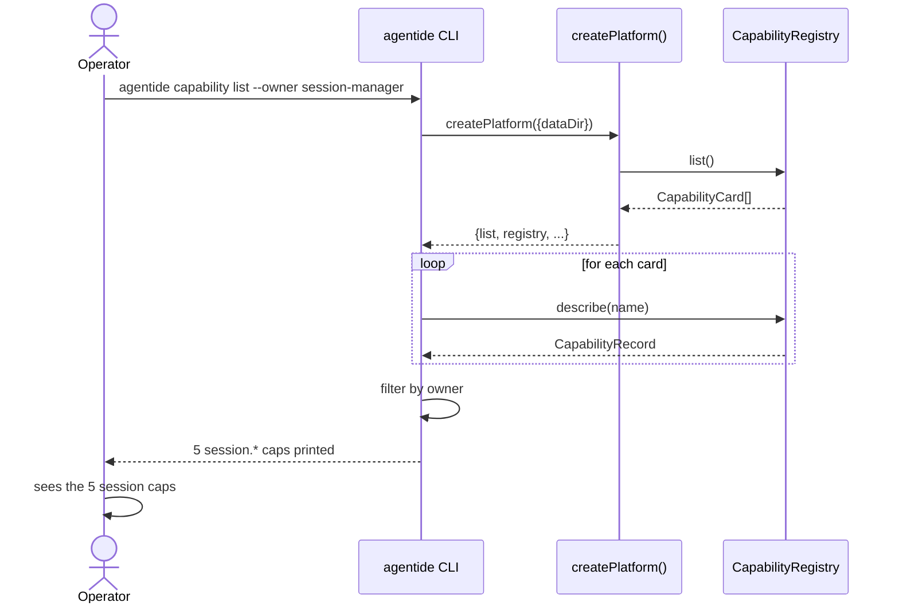

# FLOW: Platform Capabilities

## Status

- Type: End-to-end behavior and flow document
- Audience: Engineering, QA, ops
- Scope: Definitively describe how `@platform/platform-capabilities` registers 25 platform caps, how the kernel routes invocations of those caps (esp. `plugin.*` and `system.*`), and how the CLI's new `--owner` / `--tier` filters behave in practice.
- PRD: [PRD-platform-capabilities.md](./PRD-platform-capabilities.md)
- TRD: [TRD-platform-capabilities.md](./TRD-platform-capabilities.md)
- GRILL: [GRILL-platform-capabilities.txt](./GRILL-platform-capabilities.txt)

## Overview

A new package registers all 25 platform-cap records with the Capability Registry under the real owners (`session-manager`, `capability-registry`, `gateway`, `plugin-manager`). The factory's `registerGatewayCapabilities` is removed in favor of `registerPlatformCapabilities`. The kernel's `checkAuthz` learns to treat `*` in the namespace slot as a wildcard so that `platform.*.read` covers every read-tier platform cap. The `agentide capability list` CLI gains `--owner` and `--tier` filters. Operators mint read-only tokens with a single scope; agents discover and invoke `plugin.*` and `system.*` caps through any adapter.

---

## Flow 1: Operator lists caps by owner (CLI — primary happy path)

### Trigger

A junior operator runs `agentide capability list --owner session-manager` to see which session caps exist.

### Steps

1. Operator types `agentide capability list --owner session-manager` in a shell.
2. `runCli` (in `packages/agentide/src/cli.ts:200-231`) parses the argv, lands on `capability list` with `--owner=session-manager`.
3. `runCapability` calls `createPlatform({dataDir})` and asks `platform.capabilityRegistry.list()` for the full catalog. `list()` returns `readonly CapabilityCard[]` (no `owner` field per the registry's type).
4. For each `CapabilityCard`, the CLI calls `platform.capabilityRegistry.describe(name)` to get the full `CapabilityRecord` (which has `owner`).
5. The CLI filters records where `record.owner === "session-manager"`.
6. The CLI prints each match as `- <name>\t<version>\t<description>` and exits 0.

### Mermaid diagram

### Postconditions

- The 5 `session.*` caps are printed.
- `platform.*` filters not applied; no other caps appear.
- The agentide CLI exits 0.

---

## Flow 2: Agent installs a plugin via capability call (MCP)

### Trigger

An MCP agent (Claude Code, etc.) calls `tools/call {name: "plugin.install", arguments: {source: "./browser.yaml"}}`.

### Steps

1. MCP adapter decodes the JSON-RPC envelope; constructs a `CanonicalInvocation` with `capability.name = "plugin.install"`, `input = {source: "./browser.yaml"}`, `sessionId = undefined` (system call, no session).
2. MCP adapter calls `gateway.handleInvocation(req)`.
3. The kernel verifies the caller's JWT (scope includes `platform.plugin.write`).
4. The kernel authorizes the call (tier-hierarchy: `platform.plugin.write` covers `platform.plugin.write`).
5. The kernel resolves the capability record: `plugin.install` is owned by `plugin-manager`.
6. The kernel dispatches to `gatewayHandlers["plugin.install"]` (the new handler in `buildGatewayHandlers`).
7. The handler calls `pluginManager.install("./browser.yaml")`.
8. Plugin Manager parses the manifest, validates, persists install record, registers `plugin:browser` capability records for the runtime plugin's caps, returns `InstallRecord`.
9. The handler wraps the result and returns `{output: InstallRecord}`.
10. The kernel audits the call (status=ok, owner=plugin-manager, duration=N ms).
11. The kernel publishes `gateway.invocation` on the Event Bus.
12. The kernel returns `{output: InstallRecord}` to the adapter.
13. The MCP adapter encodes `{result: {content: [{type: "text", text: JSON.stringify(output)}], structuredContent: output}}` and sends it back to the agent.

### Postconditions

- The plugin is installed; its `InstallRecord` is persisted to `~/.agentide/data/installed-plugins.json`.
- The plugin's capabilities are registered with the registry under `owner: "plugin:browser"`.
- The plugin fires `plugin.installed` on the Event Bus.
- The audit log contains one entry: `{status: "ok", capability: "plugin.install", owner: "plugin-manager", ...}`.
- The agent sees the install record.

---

## Flow 3: Operator mints a read-only token with wildcard scope

### Trigger

An operator runs `agentide token issue --tenant acme --caller dashboard-bot --scope platform.*.read` to give a dashboard a read-only token.

### Steps

1. `runToken` parses argv, calls `createPlatform({dataDir})`.
2. `runToken` issues via `platform.gateway.issueToken({tenantId: "acme", callerId: "dashboard-bot", scope: ["platform.*.read"]})`.
3. The gateway factory's `issueToken` builds a `TokenClaims` with `scope: ["platform.*.read"]`, signs HS256 with the secret, returns the JWT.
4. The CLI prints the JWT.
5. The dashboard presents `Authorization: Bearer <jwt>` on every call.
6. On a `session.list` invocation:
   - The kernel verifies the JWT (signature valid, not expired).
   - The kernel extracts `scope: ["platform.*.read"]`.
   - The kernel looks up `session.list` → `permissions: ["platform.session.read"]`.
   - `checkAuthz(["platform.*.read"], ["platform.session.read"])` → `tierCovers("platform.*.read", "platform.session.read")`:
     - `gr = 1` (read), `req = 1` (read).
     - `parts[0] === "platform"` ✓.
     - `grantedParts[1] === "*"` → wildcard match (per the new TRD fix).
     - Returns `true`.
   - The call proceeds.
7. On a `session.create` invocation:
   - `session.create` requires `["platform.session.write"]`.
   - `checkAuthz(["platform.*.read"], ["platform.session.write"])`:
     - `gr = 1` (read), `req = 2` (write).
     - Wildcard namespace match → `gr >= req` → `1 >= 2` → `false`.
   - The call is denied with `GATEWAY_INSUFFICIENT_SCOPE`.

### Postconditions

- The token works for every read-tier cap (session.list, tenant.list, capability.list, gateway.status, plugin.list, system.*).
- The token is denied for every write-tier cap (session.create, plugin.install, etc.).
- The audit log captures every call with `status: "ok"` or `status: "denied"` accordingly.

---

## Flow 4: Fresh install vs. upgrade migration

### Trigger

Either a fresh `agentide init` (no prior state) or an upgrade from a pre-BI[6] platform (registry has 16 caps under owner=`gateway`).

### Case A: Fresh install

1. `createPlatform` calls `registerPlatformCapabilities(registry)`.
2. Phase 1: `registry.register("gateway", { owner: "gateway", capabilities: [12 caps stay] })`. `added: [12]`, `removed: []`, `updated: []`. No prior state.
3. Phase 2: `registry.register("session-manager", { ...5 caps })`. `added: [5]`.
4. Phase 2: `registry.register("capability-registry", { ...2 caps })`. `added: [2]`.
5. Phase 2: `registry.register("plugin-manager", { ...6 caps })`. `added: [6]`.
6. **Total: 12 + 5 + 2 + 6 = 25 caps** (4 tenant.* + 3 gateway.* + 2 auth.token.* + 3 system.* under `gateway`; 5 session.* under `session-manager`; 2 capability.* under `capability-registry`; 6 plugin.* under `plugin-manager`).

### Case B: Upgrade from pre-BI[6]

1. `createPlatform` calls `registerPlatformCapabilities(registry)`.
2. Phase 1: `registry.register("gateway", { owner: "gateway", capabilities: [12 caps stay] })`. The registry diffs against the legacy 16 caps under `gateway`. The new manifest claims 12 under `gateway`; the legacy 16 minus the 12 stays = 7 removed (`session.create`, `session.resume`, `session.destroy`, `session.touch`, `session.list`, `capability.list`, `capability.describe`). `removed: [7]`. Phase 1 cleans these 7 caps out of `gateway`'s manifest in the global store.
3. Phase 2: `registry.register("session-manager", { ...5 caps })`. Global store no longer has these names under any other owner (phase 1 removed `session.*` from `gateway`). `added: [5]`.
4. Phase 2: `registry.register("capability-registry", { ...2 caps })`. Same. `added: [2]`.
5. Phase 2: `registry.register("plugin-manager", { ...6 caps })`. These are new registrations; no prior state. `added: [6]`.
6. **Total: 12 + 5 + 2 + 6 = 25 caps** under the correct owners.

### Postconditions

- The registry contains exactly 25 caps under the correct owners.
- Cross-owner collision check passes (no `(name, version)` pair appears under two owners).
- The audit log is unchanged (no audit entries from registration; registration events go to the Event Bus as `capability.registered` / `capability.removed`).

---

## Flow 5: Error — INSUFFICIENT_SCOPE on write cap with read-only token

### Trigger

A read-only token (scope `["platform.*.read"]`) tries to install a plugin: `gateway.handleInvocation({capability: {name: "plugin.install"}, input: {source: "./x.yaml"}})`.

### Steps

1. The kernel verifies the JWT (signature valid, scope confirmed).
2. The kernel rate-limit checks (pass).
3. The kernel resolves the capability: `plugin.install` requires `permissions: ["platform.plugin.write"]`.
4. `checkAuthz(["platform.*.read"], ["platform.plugin.write"])`:
   - `gr = 1` (read), `req = 2` (write).
   - Wildcard namespace match → `gr >= req` → `1 >= 2` → `false`.
   - Returns `false`.
5. The kernel returns `{error: {code: "GATEWAY_INSUFFICIENT_SCOPE", message: "caller scope does not cover ...", details: {required: "platform.plugin.write", granted: "platform.*.read"}, retryable: false}}`.
6. The audit log receives `{status: "denied", denyReason: "GATEWAY_INSUFFICIENT_SCOPE", ...}`.
7. The Event Bus fires `gateway.invocation` with the audit record.

### Postconditions

- No plugin is installed.
- The caller's token is unchanged (no revocation).
- The audit log has one new entry with `status: "denied"`.

### Recovery

The operator re-issues the token with a higher scope. Per the PRD, the `platform.*.read` wildcard is a read-only convenience; a write-cap call needs a write-tier scope.

---

## Flow 6: Edge case — `plugin.install` with a missing source file

### Trigger

An agent calls `plugin.install` with `source: "./missing.yaml"` (file does not exist).

### Steps

1. The kernel authorizes the call (caller has `platform.plugin.write`).
2. The kernel dispatches to `gatewayHandlers["plugin.install"]`.
3. The handler calls `pluginManager.install("./missing.yaml")`.
4. Plugin Manager's `install` reads the source file via `fs.readFile(...)` → file NOT FOUND.
5. Plugin Manager throws `PluginManagerError({code: "PLUGIN_INSTALL_FAILED", message: "cannot read source ...", details: {path: "./missing.yaml"}})`.
6. The handler's `wrap` helper rejects the promise (the wrapped function throws).
7. The kernel's `dispatchCapability` catches the error and wraps it: `GATEWAY_MANAGER_UNAVAILABLE` (a generic error code for plugin manager failures).
8. The kernel returns `{error: {code: "GATEWAY_MANAGER_UNAVAILABLE", ...}}`.
9. The audit log receives `{status: "error", errorCode: "GATEWAY_MANAGER_UNAVAILABLE", errorMessage: "cannot read source ...", ...}`.

### Postconditions

- No plugin is installed; no install record persisted.
- The audit log captures the error.
- The agent sees the structured error and can decide whether to retry (retryable: false).

---

## Manual QA Checklist

### Setup

- [ ] Build the workspace: `pnpm install && pnpm run build` (zero errors). [AC-7]
- [ ] Run the full test suite: `pnpm run test` (all 242+ tests pass). [AC-7]
- [ ] Run precommit: `pnpm run lint && pnpm run typecheck` (zero errors, zero warnings). [AC-7]

### Happy path

- [ ] `agentide init --data-dir /tmp/q1` prints a bootstrap token. [AC-1]
- [ ] `agentide capability list --owner session-manager` lists exactly 5 caps: `session.create`, `session.resume`, `session.destroy`, `session.touch`, `session.list`. [AC-1]
- [ ] `agentide capability list --owner capability-registry` lists exactly 2 caps: `capability.list`, `capability.describe`. [AC-1]
- [ ] `agentide capability list --owner plugin-manager` lists exactly 6 caps: `plugin.install`, `plugin.uninstall`, `plugin.enable`, `plugin.disable`, `plugin.reload`, `plugin.list`. [AC-2]
- [ ] `agentide capability list --owner gateway` lists exactly 12 caps: 4 tenant.* + 3 gateway.* + 2 auth.token.* + 3 system.*. [AC-1]
- [ ] `agentide capability list --tier read` lists every read-tier cap (no write-tier caps). [AC-2]
- [ ] `agentide capability list --tier write` lists every write-tier cap (no read-tier caps). [AC-2]
- [ ] `agentide capability list --owner plugin-manager --tier read` lists only `plugin.list`. [AC-2]
- [ ] `agentide token issue --tenant acme --caller bot --scope platform.*.read` returns a JWT. [AC-4]
- [ ] Using that JWT, invoke `session.list` → succeeds. [AC-4]
- [ ] Using that JWT, invoke `plugin.list` → succeeds. [AC-4]
- [ ] Using that JWT, invoke `gateway.status` → succeeds. [AC-4]
- [ ] Using that JWT, invoke `system.info` → succeeds. [AC-4]
- [ ] Using that JWT, invoke `system.version` → succeeds. [AC-4]
- [ ] Using that JWT, invoke `system.health` → succeeds. [AC-4]
- [ ] Using that JWT, invoke `session.create` → denied with `GATEWAY_INSUFFICIENT_SCOPE`. [AC-4]
- [ ] Using that JWT, invoke `plugin.install` → denied with `GATEWAY_INSUFFICIENT_SCOPE`. [AC-4]

### Plugin management via invocation (AC-3)

- [ ] Mint a write-capable token: `agentide token issue --tenant acme --caller admin --scope platform.plugin.write`.
- [ ] Using that token, invoke `plugin.install` with a valid manifest → `InstallRecord` returned. [AC-3]
- [ ] `agentide plugin list` shows the installed plugin. [AC-3]
- [ ] Invoke `plugin.list` instead → returns the same data via the registry. [AC-3]
- [ ] Invoke `plugin.disable <id>` → returns `{id, enabled: false}`. [AC-3]
- [ ] Invoke `plugin.enable <id>` → returns `{id, enabled: true}`. [AC-3]
- [ ] Invoke `plugin.reload <id>` → returns `{id, version, reloadedAt}`. [AC-3]
- [ ] Invoke `plugin.uninstall <id>` → returns `{uninstalled: true}`. [AC-3]

### System introspection (AC-4)

- [ ] Invoke `system.info` → returns `{name: "agentide", version: "<semver>"}`. [AC-4]
- [ ] Invoke `system.version` → returns `{version: "<semver>", buildHash: null}`. [AC-4]
- [ ] Invoke `system.health` → returns `{status: "ok"}`. [AC-4]

### Migration (AC-1, AC-5)

- [ ] Inspect `packages/gateway-core/src/factory.ts` — `registerGatewayCapabilities` is REMOVED. [AC-5]
- [ ] `grep -r "registerGatewayCapabilities" packages/` returns no source matches (only possibly an old comment). [AC-5]
- [ ] `grep -n "registerPlatformCapabilities" packages/gateway-core/src/factory.ts` shows the new call. [AC-5]
- [ ] Fresh install: `agentide init` then `agentide capability list` shows all 25 caps. [AC-1, AC-2]
- [ ] Upgrade test: pre-register 16 caps under owner=`gateway` in a test setup, then call `registerPlatformCapabilities` — registry cleanly transitions to 25 caps under the correct owners with no cross-owner collision. [AC-1]

### Error handling

- [ ] Invoke `plugin.install` with a missing source file → returns `GATEWAY_MANAGER_UNAVAILABLE` with details. [AC-7]
- [ ] Invoke `plugin.install` without `platform.plugin.write` scope → denied with `GATEWAY_INSUFFICIENT_SCOPE`. [AC-4]
- [ ] Invoke a non-existent capability `capability.does.not.exist` → returns `GATEWAY_CAPABILITY_NOT_FOUND`. [AC-7]

### Edge cases

- [ ] Invoke `capability.list` with a token whose scope is `["platform.capability.read"]` (only) → succeeds. [AC-4]
- [ ] Invoke `capability.list` with a token whose scope is `["platform.*.read"]` → succeeds (wildcard covers). [AC-4]
- [ ] Invoke `platform.*.read` wildcard against a `runtime.*` capability → denied (kind mismatch). [AC-4]
- [ ] `agentide capability list --owner nonexistent` → returns empty list (no error). [AC-6]

### Cleanup / teardown

- [ ] `agentide plugin uninstall <id>` removes the test plugin.
- [ ] `rm -rf /tmp/q1` removes the data dir.
