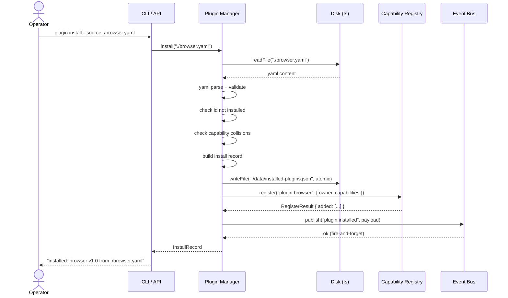
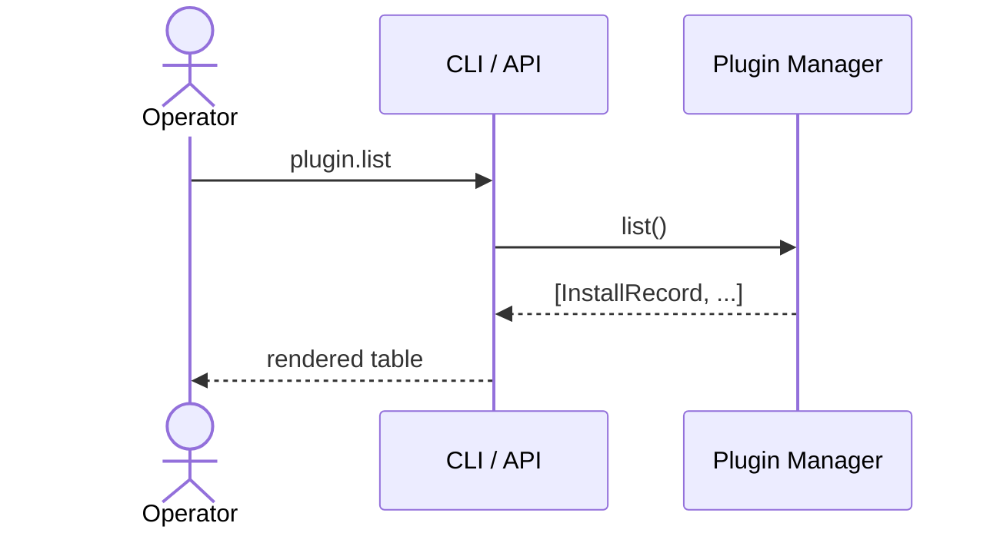
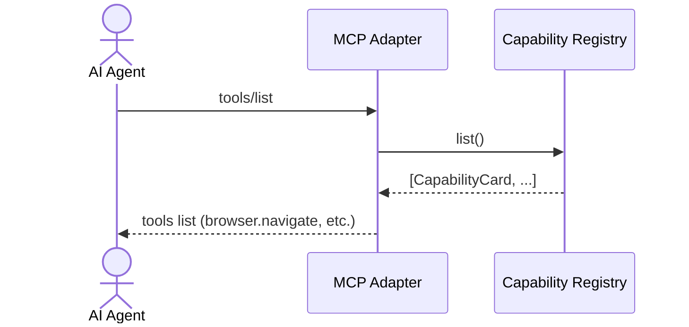
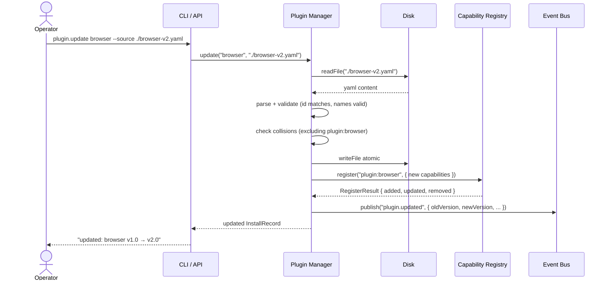
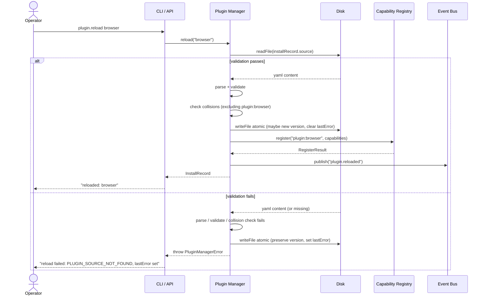
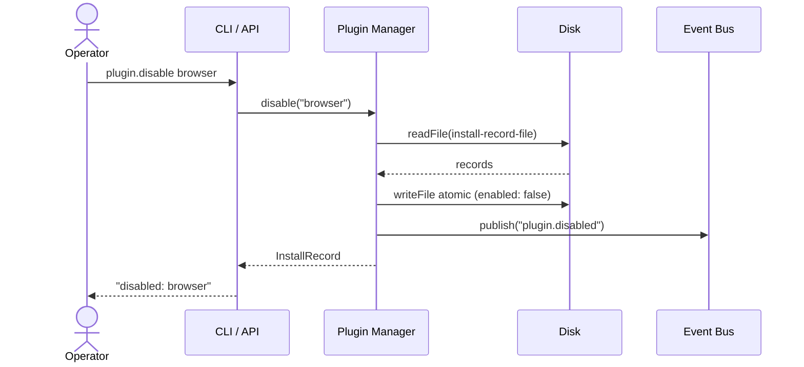
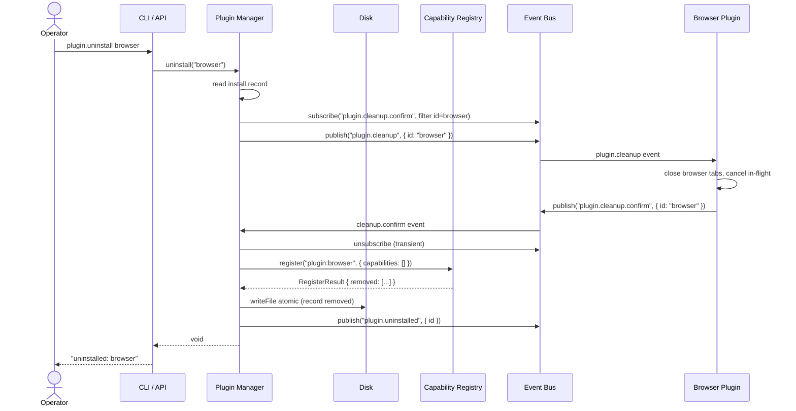
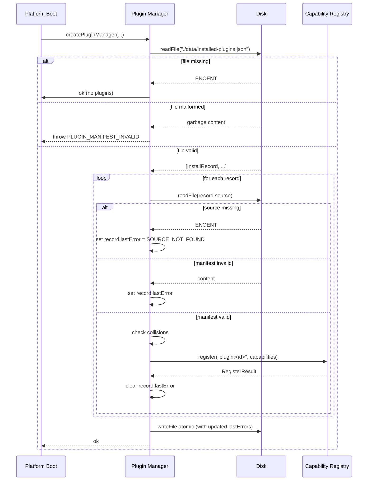

# FLOW: Plugin Manager

## Status

- Type: End-to-end behavior and flow document
- Audience: Product, engineering, QA
- Scope: In-process control-plane component that installs, updates, disables, enables, reloads, lists, and uninstalls plugins from a local Plugin Manifest, with persistent install state and Event Bus integration.
- PRD: [PRD-plugin-manager.md](./PRD-plugin-manager.md)
- TRD: [TRD-plugin-manager.md](./TRD-plugin-manager.md)

## Overview

The Plugin Manager accepts operator commands (`install`, `update`, `reload`, `disable`, `enable`, `uninstall`, `list`) and translates each into a coordinated sequence: read source from disk, parse + validate the manifest, register capabilities with the Capability Registry, persist install state to `./data/installed-plugins.json`, and publish a `plugin.*` event on the Event Bus. On startup the manager re-installs every plugin from its source, tolerating missing source files (the install record is preserved, the operator can fix and reload). Every operator-facing error returns a structured `{ code, message, details }` shape so automation and dashboards can match on stable codes.

---

## Flow 1: Primary Happy Path — Install a Plugin

The canonical install flow. Operator points at a local manifest file, the Plugin Manager parses, validates, registers capabilities, persists, and fires `plugin.installed`.

### Trigger

Operator runs `plugin.install --source ./browser.yaml` (or the equivalent API call: `pluginManager.install("./browser.yaml")`).

### Steps

1. CLI (or API caller) invokes `pluginManager.install("./browser.yaml")`.
2. Plugin Manager calls `fs.readFile("./browser.yaml")` → returns the YAML content.
3. Plugin Manager calls `yaml.parse(content)` → returns the parsed manifest object.
4. Plugin Manager validates the manifest:
   - Exactly one of `runtime:` / `service:` / `developer:` is present.
   - The chosen key has a non-empty `id`.
   - `version` is a non-empty string.
   - `capabilities` (if present) is an array of strings matching `domain.action`.
   - No `capabilities[i]` collides with a capability already registered (across all owners).
5. Plugin Manager confirms the id is not already installed.
6. Plugin Manager builds the install record (`{ id, type, version, source, installedAt: clock.now(), enabled: true }`).
7. Plugin Manager atomically writes `./data/installed-plugins.json` (write to `.tmp`, then rename).
8. Plugin Manager calls `capabilityRegistry.register("plugin:<id>", { owner: "plugin:<id>", capabilities })`.
9. Plugin Manager publishes `plugin.installed` on the Event Bus with `{ id, type, version, source, installedAt }`.
10. Plugin Manager returns the install record to the caller.
11. CLI renders the install record (id, type, version, source, "enabled").

### Mermaid diagram

### Postconditions

- The install record is on disk at `./data/installed-plugins.json`.
- The plugin's capabilities are registered in the Capability Registry and discoverable via `capability.list` / `capability.search` / `capability.describe`.
- `plugin.installed` has been published on the Event Bus (at least one subscriber received it before the next event-bus tick).
- The install record is returned to the caller and rendered by the CLI.

---

## Flow 2: Add / Create Flow — List Installed Plugins

Read-only retrieval. Returns the current install records.

### Trigger

Operator runs `plugin.list` (or the equivalent API call: `pluginManager.list()`).

### Steps

1. CLI invokes `pluginManager.list()`.
2. Plugin Manager returns the array of install records (in insertion order).
3. CLI renders each record (id, type, version, source, installedAt, enabled).

### Mermaid diagram

### Postconditions

- No state change.
- No event fired.
- Operator sees the current set of installed plugins.

---

## Flow 3: Retrieve / Use Flow — Capability Discovery

The downstream consumer (Gateway, AI agent, Dashboard) looks up a plugin's capabilities via the Capability Registry. This flow is owned by the Capability Registry, not the Plugin Manager, but it's the flow that motivates the install flow.

### Trigger

A consumer (e.g. an MCP adapter handling a `tools/list` request from an AI agent) calls `capabilityRegistry.list()` or `capabilityRegistry.search("browser")`.

### Steps

1. Consumer queries the Capability Registry.
2. Capability Registry returns the catalog (including capabilities registered by plugins).
3. Consumer renders the capabilities to the agent.

### Mermaid diagram

### Postconditions

- The agent discovers the plugin's capabilities through the standard capability discovery path.
- This works because the Plugin Manager called `capabilityRegistry.register()` during install.

---

## Flow 4: Update / Refresh Flow — Update a Plugin to a New Version

Operator upgrades a plugin to a new version. The Plugin Manager swaps the install record and re-registers capabilities.

### Trigger

Operator runs `plugin.update browser --source ./browser-v2.yaml`.

### Steps

1. CLI invokes `pluginManager.update("browser", "./browser-v2.yaml")`.
2. Plugin Manager reads the install record for `browser`. Fails with `PLUGIN_NOT_INSTALLED` if not installed.
3. Plugin Manager reads the new manifest file, parses, validates.
4. Plugin Manager validates the new manifest's id matches the install record's id.
5. Plugin Manager validates the new capability name format.
6. Plugin Manager checks for collisions with capabilities NOT owned by this plugin (the plugin's own capabilities will be replaced).
7. Plugin Manager atomically writes the updated install record (with the new version and source).
8. Plugin Manager calls `capabilityRegistry.register("plugin:browser", { owner, capabilities: newCapabilities })`. The registry diffs and applies additions, updates, and removals in one call.
9. Plugin Manager publishes `plugin.updated` with `{ id, oldVersion, newVersion, source, updatedAt }`.
10. Returns the updated install record.

### Mermaid diagram

### Postconditions

- The install record reflects the new version and source on disk.
- The Capability Registry has the new capabilities registered; old capabilities (no longer in the manifest) are removed; changed capabilities are updated.
- In-flight capability invocations complete against the old handler references (the registry's diffing preserves existing handler objects until consumers drop their references).
- New capability invocations route to the new handlers (via the standard capability-routing path).
- `plugin.updated` has been published.

---

## Flow 5: Error / Fallback Flow — Multiple Sub-flows

The Plugin Manager has several distinct error modes. Each returns a structured `{ code, message, details }` shape and preserves or restores state according to the rules below.

### 5a. Source file not found

**Trigger**: Operator runs `plugin.install --source ./missing.yaml` and the file does not exist.

**Steps**:
1. Plugin Manager calls `fs.readFile("./missing.yaml")` → throws `ENOENT`.
2. Plugin Manager catches the error and throws `PluginManagerError("PLUGIN_SOURCE_NOT_FOUND", "source file ./missing.yaml does not exist", { source: "./missing.yaml" })`.
3. CLI renders the error.

**Recovery**: Operator checks the file path. Re-runs with the correct path.

**State preservation**: No install record created. No capabilities registered. No event fired. No install-record file written.

### 5b. Manifest invalid (YAML parse error)

**Trigger**: Operator's manifest file has invalid YAML.

**Steps**:
1. `yaml.parse(content)` throws `YAMLParseError`.
2. Plugin Manager catches and re-throws as `PluginManagerError("PLUGIN_MANIFEST_INVALID", "<prettified error message>", { source: "./bad.yaml", line: N, column: M })`. The line and column come from `YAMLParseError.linePos[0]` (confirmed by `opensrc` on `yaml@2.6.0` source at `src/errors.ts`).
3. CLI renders the error with file:line:column.

**Recovery**: Operator fixes the YAML at the indicated line. Re-runs.

**State preservation**: Same as 5a.

### 5c. Manifest schema invalid (no type key, multiple type keys, missing id, missing version)

**Trigger**: Manifest parses as valid YAML but lacks a plugin type, has multiple type keys, or is missing required fields.

**Steps**:
1. Validator detects the structural issue.
2. Throws `PluginManagerError("PLUGIN_TYPE_MISSING" | "PLUGIN_TYPE_AMBIGUOUS" | "PLUGIN_ID_MISSING" | "PLUGIN_VERSION_MISSING", ..., { source, expected, got })`.
3. CLI renders the error.

**Recovery**: Operator fixes the manifest structure. Re-runs.

**State preservation**: Same as 5a.

### 5d. Capability name invalid (not matching `domain.action` format)

**Trigger**: Manifest declares `capabilities: [browser Navigate]` (space) or `capabilities: [Browser.navigate]` (uppercase first char).

**Steps**:
1. Validator iterates the capabilities list. First invalid name triggers the error.
2. Throws `PluginManagerError("PLUGIN_CAPABILITY_NAME_INVALID", "capability X is not in the required format", { capability: "X", format: "domain.action" })`.
3. CLI renders the error.

**Recovery**: Operator renames the capability. Re-runs.

**State preservation**: Same as 5a.

### 5e. Capability collision (name already registered by another owner)

**Trigger**: Manifest declares `capabilities: [customer.read]` but the ecommerce app's Backend SDK has already registered `customer.read`.

**Steps**:
1. Plugin Manager pre-checks collisions against the Capability Registry's catalog (excluding the plugin's own capabilities if updating).
2. Throws `PluginManagerError("PLUGIN_CAPABILITY_COLLISION", "capability X is already registered", { capability: "X", existingOwner: "ecommerce-app" })`.
3. CLI renders the error.

**Recovery**: Operator renames the capability, OR stops the existing owner and retries (the existing owner must give up `customer.read` first). Re-runs.

**State preservation**: Same as 5a.

### 5f. Install attempted for an id that already exists

**Trigger**: Operator runs `plugin.install --source ./browser.yaml` for `browser`, which is already installed.

**Steps**:
1. Plugin Manager reads the install records. Finds `browser` already there.
2. Throws `PluginManagerError("PLUGIN_ID_ALREADY_INSTALLED", "plugin browser is already installed", { id: "browser", suggestedCommand: "plugin.update browser --source <new-source>" })`.
3. CLI renders the error and the suggested command.

**Recovery**: Operator runs `plugin.update browser --source ...` instead, or runs `plugin.uninstall browser` first then re-installs.

**State preservation**: No state change. The existing install is untouched.

### 5g. Registry-id install attempted (marketplace pack not shipped)

**Trigger**: Operator runs `plugin.install browser` (no `--source`).

**Steps**:
1. CLI detects the absence of `--source` and routes the call to `installFromRegistry("browser")`.
2. `installFromRegistry` throws `PluginManagerError("PLUGIN_MARKETPLACE_UNAVAILABLE", "marketplace lookup is not available", { hint: "use --source for local install, or install the marketplace pack" })`.
3. CLI renders the error.

**Recovery**: Operator uses `plugin.install --source ./browser.yaml` instead, OR waits for the marketplace pack to ship.

**State preservation**: No state change.

### 5h. Cleanup timeout during uninstall

**Trigger**: Operator runs `plugin.uninstall browser` but the plugin never confirms cleanup within `cleanupTimeoutMs` (default 5000ms).

**Steps**:
1. Plugin Manager fires `plugin.cleanup`.
2. Plugin Manager subscribes (transient) to `plugin.cleanup.confirm` filtered by id, with a `cleanupTimeoutMs` timeout.
3. Timeout fires. Plugin Manager logs a warning, sets the install record's `lastError = { code: "PLUGIN_CLEANUP_TIMEOUT", ... }` (this is metadata visible in subsequent `plugin.list` calls but does NOT block the uninstall).
4. Plugin Manager unregisters capabilities, removes the install record, fires `plugin.uninstalled`.
5. CLI renders "uninstalled (cleanup timed out — plugin may have leaked resources)".

**Recovery**: Operator inspects the plugin's logs / state for leaked resources. Re-installs the plugin if needed. The `lastError` is cleared on next successful install/update/reload.

**State preservation**: The install record IS removed (the platform considers the plugin uninstalled). The plugin's actual cleanup state is the plugin's responsibility, not the platform's.

---

## Flow 6: Edge Case — Reload a Plugin from Source

Operator fixed a typo in the manifest. They don't want to bump the version — just re-read.

### Trigger

Operator runs `plugin.reload browser`.

### Steps

1. CLI invokes `pluginManager.reload("browser")`.
2. Plugin Manager reads the install record. Fails with `PLUGIN_NOT_INSTALLED` if not installed.
3. Plugin Manager reads the install record's `source` field as the file path.
4. Plugin Manager reads, parses, validates the manifest (same validation as install/update).
5. Plugin Manager checks for collisions (excluding the plugin's own capabilities).
6. If validation succeeds:
   - If the manifest version differs from the install record's version, update the install record's version field.
   - If the manifest version is the same, leave the install record's version field alone.
   - Atomically write the install record.
   - Re-register capabilities with Capability Registry.
   - Clear any `lastError`.
   - Publish `plugin.reloaded`.
7. If validation fails:
   - Set `record.lastError = { code, message, details }`.
   - Atomically write the install record (preserving the prior version + adding lastError).
   - Throw the error.

### Mermaid diagram

### Postconditions

**On success:** The install record reflects any new version. Capabilities re-registered. `plugin.reloaded` fired. Any prior `lastError` is cleared.

**On validation failure:** The install record is preserved on disk. The `lastError` is set with the structured error. The CLI renders the error.

---

## Flow 7: Edge Case — Disable and Enable

State-only changes. Capabilities stay registered.

### Trigger

Operator runs `plugin.disable browser` or `plugin.enable browser`.

### Steps (disable)

1. CLI invokes `pluginManager.disable("browser")`.
2. Plugin Manager reads the install record. Fails with `PLUGIN_NOT_INSTALLED` if not installed.
3. If already disabled, return the record unchanged (no-op, no event).
4. Atomically write the install record with `enabled: false`.
5. Publish `plugin.disabled`.

### Steps (enable)

1. CLI invokes `pluginManager.enable("browser")`.
2. Plugin Manager reads the install record. Fails with `PLUGIN_NOT_INSTALLED` if not installed.
3. If already enabled, return the record unchanged.
4. Atomically write the install record with `enabled: true`.
5. Publish `plugin.enabled`.

### Mermaid diagram

### Postconditions

- The install record's `enabled` flag is updated on disk.
- `plugin.disabled` (or `plugin.enabled`) is published.
- Capabilities remain registered in the Capability Registry.
- A consumer checking `plugin.list` sees the new state. A consumer routing capability invocations against this plugin gets a "plugin disabled" error from the Plugin Manager (a future Gateway integration concern — for v1 the Plugin Manager just records the state).

---

## Flow 8: Edge Case — Uninstall with Cleanup Protocol

The most complex flow. The plugin gets a chance to clean up its own resources before the install record is removed.

### Trigger

Operator runs `plugin.uninstall browser`.

### Steps

1. CLI invokes `pluginManager.uninstall("browser")`.
2. Plugin Manager reads the install record. Fails with `PLUGIN_NOT_INSTALLED` if not installed.
3. Plugin Manager subscribes (transient) to `plugin.cleanup.confirm` with a pattern matching `plugin.cleanup.confirm` and a payload filter for `id === "browser"`. Timeout: `cleanupTimeoutMs` (default 5000ms).
4. Plugin Manager publishes `plugin.cleanup` with `{ id: "browser" }`.
5. The plugin's cleanup handler runs, cleans up its own resources (closes browser tabs, cancels in-flight handlers, etc.).
6. The plugin emits `plugin.cleanup.confirm` with `{ id: "browser" }`.
7. Plugin Manager's transient subscription receives the confirm, unsubscribes itself.
8. Plugin Manager calls `capabilityRegistry.register("plugin:browser", { owner, capabilities: [] })`. The registry diffs and removes all of `plugin:browser`'s capabilities.
9. Plugin Manager atomically writes the install-record file with the record removed.
10. Plugin Manager publishes `plugin.uninstalled` with `{ id, uninstalledAt }`.

### Mermaid diagram

### Postconditions (success path)

- The install record is removed from disk.
- All of `plugin:browser`'s capabilities are unregistered from the Capability Registry.
- `plugin.cleanup` and `plugin.uninstalled` have both been published.
- The plugin has cleaned up its own resources (verified by the confirm event).
- A subsequent `plugin.list` does not include `browser`.

### Postconditions (timeout path)

- Same as above, except the plugin's resources may not be cleaned up (the plugin author is responsible for handling cleanup correctly within the timeout).
- The install record's `lastError` field is NOT set in this case (because the install record was successfully removed — `lastError` only applies to existing records).

---

## Flow 9: Edge Case — Startup Re-install

When the platform starts, every install record is re-installed from its source. This is critical for persistence to work.

### Trigger

The platform starts. `createPluginManager(eventBus, capabilityRegistry, config)` is called.

### Steps

1. Plugin Manager reads `./data/installed-plugins.json`. If the file is missing, that's fine — no plugins to re-install. Skip to end.
2. If the file is malformed (not valid JSON), throw `PluginManagerError("PLUGIN_MANIFEST_INVALID", ...)` with `{ path: "./data/installed-plugins.json" }`. The operator must fix or delete the file.
3. For each install record (in order):
   a. Plugin Manager reads the source file from `record.source`.
   b. If the source file is missing: set `record.lastError = { code: "PLUGIN_SOURCE_NOT_FOUND", message, details, at: clock.now() }`. Continue to the next record. **No event fired.**
   c. Plugin Manager parses and validates the manifest.
   d. If parse/validate fails: set `record.lastError`. Continue.
   e. Plugin Manager checks for collisions (excluding the plugin's own capabilities — they're being re-registered).
   f. If collision: set `record.lastError`. Continue.
   g. Plugin Manager calls `capabilityRegistry.register("plugin:<id>", { owner, capabilities })`. The registry's diffing is a no-op if the capabilities are already registered (which they may be, if this is the same process and the registry has them in memory).
   h. On success: clear `record.lastError`. **No event fired.**
4. Plugin Manager atomically writes the install-record file (if any records had `lastError` set, the file is updated to reflect that).
5. Plugin Manager returns. The factory caller's code can now invoke lifecycle methods.

### Mermaid diagram

### Postconditions

- The in-memory state matches what was on disk.
- Capabilities are registered with the Capability Registry (re-registered, no-op if already present).
- Records with failed re-installs carry a `lastError` field. They are visible via `plugin.list`.
- **No `plugin.*` events fire on startup.** Operators see the live state via `plugin.list`. Subscribers that want startup visibility should call `plugin.list` on boot (a future Dashboard integration concern).

---

## Manual QA Checklist

### Setup

- [ ] Workspace is at `agentide/packages/` with `@platform/event-bus` and `@platform/capability-registry` built. [AC-install, AC-list]
- [ ] `pnpm install` (or `npm install`) at the workspace root succeeds. [AC-install]
- [ ] Test directory `packages/plugin-manager/src/__tests__/` exists with a fixture manifest file `fixtures/browser.yaml` containing a runtime plugin with 3 capabilities. [AC-install]
- [ ] Test directory has a fixture `fixtures/logging.yaml` (service plugin) and `fixtures/vscode-helper.yaml` (developer plugin). [AC-install]
- [ ] Test directory has a fixture `fixtures/collision.yaml` (manifest with `customer.read`, which collides with a pre-registered Business Capability). [AC-error-collision]
- [ ] Test directory has a fixture `fixtures/malformed.yaml` (invalid YAML). [AC-error-manifest]
- [ ] Test directory has a fixture `fixtures/no-type.yaml` (no top-level type key). [AC-error-type-missing]
- [ ] Temp dir `/tmp/agentide-plugin-manager-qa/` is writable; the test setup creates `./data/installed-plugins.json` under it. [AC-persistence]

### Happy path

- [ ] `install("./fixtures/browser.yaml")` returns a record with `id: "browser"`, `type: "runtime"`, `version: "1.0"`, `enabled: true`. [AC-install-success]
- [ ] `./data/installed-plugins.json` contains exactly one record after install. [AC-install-persist]
- [ ] `capability.list()` returns the plugin's 3 capabilities after install. [AC-install-capabilities]
- [ ] `plugin.installed` event was published with the correct payload (verify via a captured subscription). [AC-install-event]
- [ ] `list()` returns the installed plugin. [AC-list]
- [ ] `get("browser")` returns the same record. [AC-list]

### Update flow

- [ ] Edit `./fixtures/browser.yaml` to version 2.0 and add a 4th capability. Save. [AC-update]
- [ ] `update("browser", "./fixtures/browser.yaml")` returns a record with `version: "2.0"`. [AC-update-success]
- [ ] `./data/installed-plugins.json` reflects the new version and source. [AC-update-persist]
- [ ] `capability.list()` now includes the new 4th capability and not the old (assuming one was removed). [AC-update-capabilities]
- [ ] `plugin.updated` event was published with `oldVersion: "1.0"`, `newVersion: "2.0"`. [AC-update-event]
- [ ] In-flight capability invocation against the old handler completes (verified via a long-running handler test fixture). [AC-update-inflight]

### Reload flow

- [ ] Edit `./fixtures/browser.yaml` (no version change) to add a 5th capability. Save. [AC-reload]
- [ ] `reload("browser")` returns the same record with `version: "2.0"` (unchanged). [AC-reload-version-unchanged]
- [ ] `capability.list()` includes the 5th capability. [AC-reload-capabilities]
- [ ] `plugin.reloaded` event was published. [AC-reload-event]
- [ ] `installedAt` is unchanged after reload (it was the original install timestamp). [AC-reload-installedAt-preserved]
- [ ] Edit `./fixtures/browser.yaml` to a new version `2.1`. Save. [AC-reload-version-bump]
- [ ] `reload("browser")` updates the install record's version to `2.1`. [AC-reload-version-bumped]

### Disable / enable

- [ ] `disable("browser")` returns a record with `enabled: false`. [AC-disable]
- [ ] `plugin.disabled` event was published. [AC-disable-event]
- [ ] `capability.list()` STILL includes the plugin's capabilities (they're not unregistered on disable). [AC-disable-capabilities-stay]
- [ ] `enable("browser")` returns a record with `enabled: true`. [AC-enable]
- [ ] `plugin.enabled` event was published. [AC-enable-event]
- [ ] `disable("browser")` again is a no-op (no event, no state change). [AC-disable-noop]
- [ ] `enable("browser")` again is a no-op. [AC-enable-noop]

### Uninstall flow

- [ ] `uninstall("browser")` returns void. [AC-uninstall]
- [ ] `plugin.cleanup` event was published first. [AC-uninstall-cleanup-first]
- [ ] `plugin.uninstalled` event was published after `cleanup`. [AC-uninstall-event]
- [ ] `./data/installed-plugins.json` does not contain `browser` after uninstall. [AC-uninstall-record-removed]
- [ ] `capability.list()` does not include the plugin's capabilities after uninstall. [AC-uninstall-capabilities-removed]
- [ ] `plugin.list()` does not include `browser` after uninstall. [AC-uninstall-list-empty]
- [ ] For a plugin that does NOT emit `plugin.cleanup.confirm`: uninstall completes after `cleanupTimeoutMs` (default 5000ms), with a warning. The install record is still removed. [AC-uninstall-timeout]
- [ ] `uninstall("not-installed")` throws `PLUGIN_NOT_INSTALLED`. [AC-uninstall-not-found]

### Persistence

- [ ] Install a plugin, then create a new `PluginManager` instance (simulating a platform restart). [AC-persistence-restart]
- [ ] The new instance's `list()` returns the same install record. [AC-persistence-restart-list]
- [ ] The new instance's `get(id)` returns the same install record. [AC-persistence-restart-get]
- [ ] Edit the install-record file manually to corrupt it (e.g. invalid JSON). Restart. Factory throws `PLUGIN_MANIFEST_INVALID` with `details.path`. [AC-persistence-malformed]
- [ ] Delete the install-record file. Restart. Factory completes with no plugins. [AC-persistence-empty]
- [ ] For an install record whose source file is missing: restart. `list()` returns the record with `lastError: { code: "PLUGIN_SOURCE_NOT_FOUND", ... }`. Other plugins still re-install. [AC-persistence-missing-source]
- [ ] Fix the missing source file. `reload("id")` clears `lastError` and re-registers capabilities. [AC-persistence-recovery]

### Registry-id install (stubbed)

- [ ] `installFromRegistry("browser")` throws `PLUGIN_MARKETPLACE_UNAVAILABLE` with `details.hint`. [AC-stub-marketplace]

### Error handling

- [ ] `install("./does-not-exist.yaml")` throws `PLUGIN_SOURCE_NOT_FOUND` with `details.source`. [AC-error-source-not-found]
- [ ] `install("./fixtures/malformed.yaml")` throws `PLUGIN_MANIFEST_INVALID` with `details.line`, `details.column`. [AC-error-yaml-invalid]
- [ ] `install("./fixtures/no-type.yaml")` throws `PLUGIN_TYPE_MISSING`. [AC-error-type-missing]
- [ ] A manifest with two top-level type keys throws `PLUGIN_TYPE_AMBIGUOUS`. [AC-error-type-ambiguous]
- [ ] A manifest with empty `id` throws `PLUGIN_ID_MISSING`. [AC-error-id-missing]
- [ ] A manifest with no `version` throws `PLUGIN_VERSION_MISSING`. [AC-error-version-missing]
- [ ] A manifest with `capabilities: ["Browser Navigate"]` (uppercase, space) throws `PLUGIN_CAPABILITY_NAME_INVALID`. [AC-error-name-invalid]
- [ ] Pre-register a Business Capability `customer.read` with the Capability Registry. Then `install("./fixtures/collision.yaml")` throws `PLUGIN_CAPABILITY_COLLISION` with `details.existingOwner`. [AC-error-collision]
- [ ] Install `browser`. Then `install("./fixtures/browser.yaml")` again throws `PLUGIN_ID_ALREADY_INSTALLED` with `details.suggestedCommand`. [AC-error-id-already-installed]
- [ ] `update("not-installed", "./fixtures/browser.yaml")` throws `PLUGIN_NOT_INSTALLED`. [AC-error-not-installed-update]
- [ ] `reload("not-installed")` throws `PLUGIN_NOT_INSTALLED`. [AC-error-not-installed-reload]
- [ ] `disable("not-installed")` throws `PLUGIN_NOT_INSTALLED`. [AC-error-not-installed-disable]
- [ ] `enable("not-installed")` throws `PLUGIN_NOT_INSTALLED`. [AC-error-not-installed-enable]

### Edge cases

- [ ] `install("./fixtures/logging.yaml")` (service plugin) succeeds with `type: "service"`. [AC-edge-service]
- [ ] `install("./fixtures/vscode-helper.yaml")` (developer plugin) succeeds with `type: "developer"`. [AC-edge-developer]
- [ ] A manifest with empty `capabilities` (or missing the field) installs with zero registered capabilities. The plugin is in `plugin.list` but contributes nothing to `capability.list`. [AC-edge-no-capabilities]
- [ ] A manifest with `metadata: { foo: bar }` is accepted; the metadata is preserved on the install record. [AC-edge-metadata] (Note: v1 install record shape does NOT include metadata; this is a follow-up to extend `InstallRecord` if a use case emerges.)
- [ ] Re-load after the install-record file has been manually edited: the edit is preserved (Plugin Manager does not rewrite the file unless a state change occurs). [AC-edge-no-rewrite-on-noop]
- [ ] A `installFromRegistry("anything")` call does NOT modify state on failure (the registry stub throws before any state change). [AC-edge-registry-stub-no-side-effects]

### Cleanup / teardown

- [ ] After QA, delete `/tmp/agentide-plugin-manager-qa/` and any other test data dirs. [cleanup]
- [ ] Verify `./data/installed-plugins.json` is removed or empty after teardown. [cleanup]