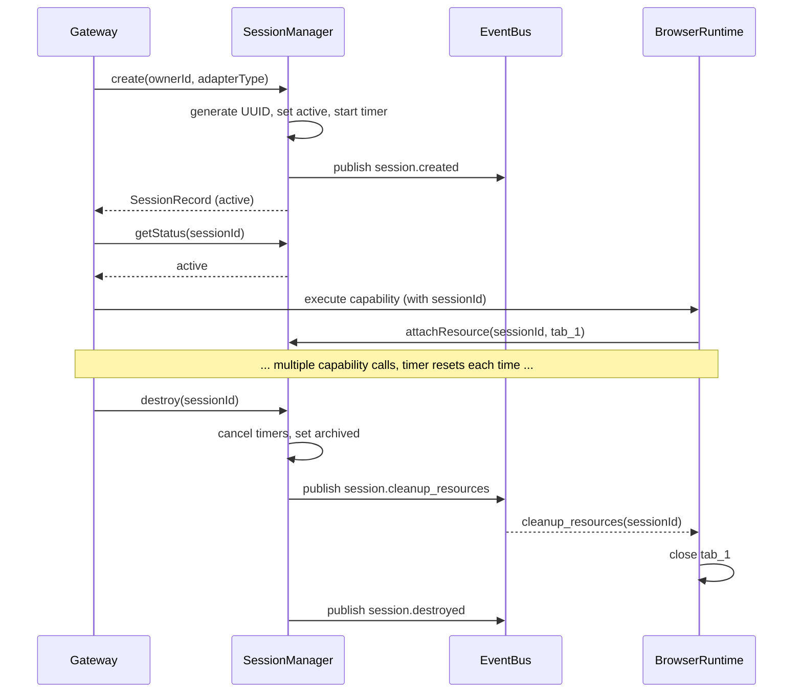
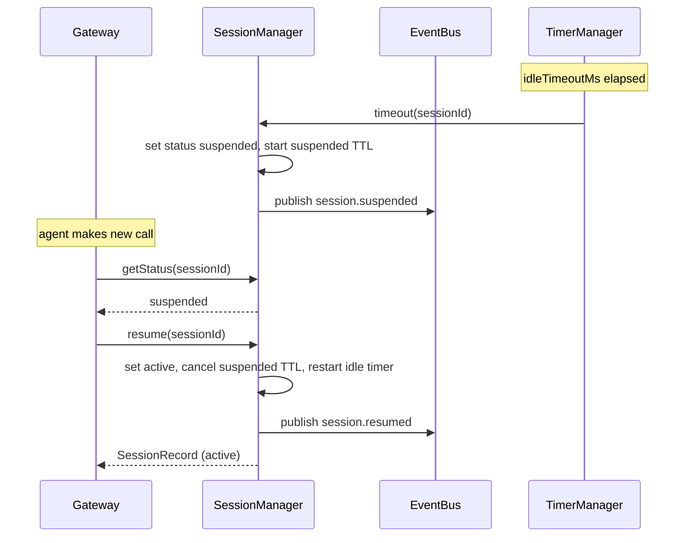
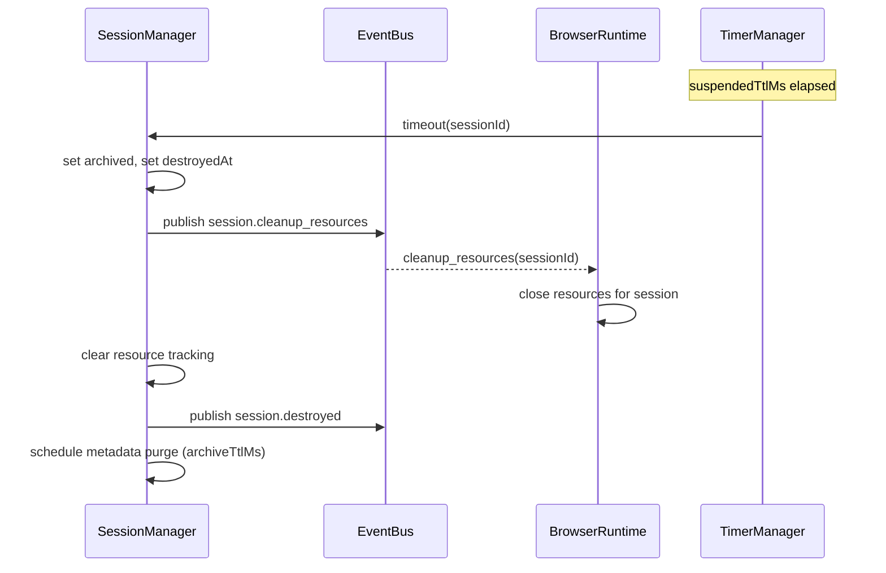

# FLOW: Session Manager

## Status

- Type: End-to-end behavior and flow document
- Audience: Platform engineering, QA
- Scope: In-process session lifecycle manager — create, suspend, resume, destroy with resource tracking and Event Bus integration.
- PRD: [PRD-session-manager.md](./PRD-session-manager.md)
- TRD: [TRD-session-manager.md](./TRD-session-manager.md)

## Overview

An adapter (MCP, CLI, REST, WebSocket) sends a request through the Gateway. The Gateway calls Session Manager to create a session. The session stays Active across multiple capability calls, auto-suspends after idle timeouts, and can be resumed. On destroy (timeout or explicit), resources are cleaned up and lifecycle events are published. No agent or adapter ever calls Session Manager directly — the Gateway is the sole caller.

---

## Flow 1: Create and Use Session (Happy Path)

An agent makes a sequence of capability calls in a single interaction.

### Trigger

Gateway receives an inbound request from an adapter that requires a new execution context.

### Participants

- Gateway
- SessionManager
- EventBus
- BrowserRuntime (example resource owner)

### Steps

1. Gateway calls `sessionManager.create({ ownerId, adapterType })`.
2. SessionManager generates UUID, sets status to `active`, sets `lastActivityAt` to now, starts idle timeout timer.
3. SessionManager publishes `session.created` on EventBus.
4. SessionManager returns `SessionRecord` with status `active`.
5. Gateway stores the session ID and passes it to every downstream capability call.
6. Agent calls a capability (e.g., `browser.navigate`). Gateway calls `sessionManager.getStatus(sessionId)` -> `active`.
7. Gateway routes to BrowserRuntime. BrowserRuntime launches a tab and calls `sessionManager.attachResource(sessionId, { id: "tab_1", type: "browser.tab", runtimeId: "br-1" })`.
8. Each capability call resets `lastActivityAt` in SessionManager via an internal `touch()` call.
9. After the agent finishes, Gateway calls `sessionManager.destroy(sessionId)`.
10. SessionManager cancels timers, sets status to `archived`, publishes `session.cleanup_resources`.
11. BrowserRuntime receives `session.cleanup_resources`, closes tab `tab_1`.
12. SessionManager clears resource tracking, publishes `session.destroyed`.

### Mermaid diagram

### Postconditions

- Session status is `archived`.
- `session.cleanup_resources` fired before `session.destroyed`.
- Browser tab `tab_1` is closed.
- Session metadata retained for archive TTL.

---

## Flow 2: Idle Timeout — Auto-Suspend

An agent pauses between steps longer than the idle timeout.

### Trigger

No capability call arrives for a session within `idleTimeoutMs`.

### Participants

- SessionManager (TimerManager internal component)
- EventBus

### Steps

1. SessionManager's TimerManager fires the idle timeout for `sessionId`.
2. TimerManager checks `lastActivityAt` — no update since timer started, session is still `active`.
3. SessionManager sets status to `suspended`. Cancels idle timeout timer. Starts suspended TTL timer.
4. SessionManager publishes `session.suspended` with `{ sessionId, lastActivityAt, suspendedAt }`.
5. The Gateway's next capability call for this session calls `sessionManager.getStatus(sessionId)` -> `suspended`.
6. Gateway calls `sessionManager.resume(sessionId)` before routing the capability.
7. SessionManager sets status to `active`, updates `lastActivityAt`, cancels suspended TTL timer, restarts idle timeout timer.
8. SessionManager publishes `session.resumed`.
9. SessionManager returns `SessionRecord` with status `active`.
10. Gateway proceeds to route the capability.

### Mermaid diagram

### Postconditions

- Session returned to `active` status.
- Resources preserved across suspend/resume (browser tab still open, auth still valid).
- `session.suspended` and `session.resumed` events published.

---

## Flow 3: Suspended TTL Expiry — Auto-Archive

A suspended session is never resumed within the TTL.

### Trigger

No `resume()` call arrives for a suspended session within `suspendedTtlMs`.

### Participants

- SessionManager (TimerManager)
- EventBus
- BrowserRuntime (subscribed to cleanup_resources)

### Steps

1. TimerManager fires the suspended TTL for `sessionId`.
2. SessionManager sets status to `archived`, sets `destroyedAt`, cancels all timers.
3. SessionManager publishes `session.cleanup_resources { sessionId }`.
4. BrowserRuntime receives the event, closes its tab for that session.
5. SessionManager clears resource tracking list for this session.
6. SessionManager publishes `session.destroyed { sessionId, reason: "expired", duration }`.
7. SessionManager schedules cleanup of archived metadata after `archiveTtlMs`.

### Mermaid diagram

### Postconditions

- Session status is `archived`.
- Resources cleaned up via Event Bus signal.
- Metadata retained for archive TTL, then purged.
- `reason` is `"expired"`.

---

## Flow 4: Explicit Destroy from Active

### Trigger

Gateway detects adapter disconnect (client disconnected, or explicit end-session signal from adapter).

### Steps

1. Gateway calls `sessionManager.destroy(sessionId, "explicit")`.
2. SessionManager cancels all timers for this session.
3. SessionManager sets status to `archived`, sets `destroyedAt`.
4. SessionManager publishes `session.cleanup_resources { sessionId }`.
5. Each subscribed runtime cleans up its resources for this session.
6. SessionManager clears resource tracking list.
7. SessionManager publishes `session.destroyed { sessionId, reason: "explicit", duration }`.

### Postconditions

- Same as Flow 3, but `reason` is `"explicit"`.
- No timers fired — destroy is immediate.

---

## Flow 5: Resource Lifecycle

A runtime creates and cleans up resources during a session.

### Participants

- Runtime (Browser, Backend, Docker, etc.)
- SessionManager

### Flow A: Register resource on creation

1. Runtime creates a resource (e.g., launches browser tab).
2. Runtime calls `sessionManager.attachResource(sessionId, { id, type, runtimeId })`.
3. SessionManager adds resource to the session's resource list.
4. If session is not active (archived or not found), SessionManager throws `SessionNotActiveError`.

### Flow B: Detach resource on independent cleanup

1. Runtime closes a resource before session destroy (e.g., user closes the browser tab manually).
2. Runtime calls `sessionManager.detachResource(sessionId, resourceId)`.
3. SessionManager removes the resource from the session's list.
4. If resource not found, it is a no-op (idempotent).

### Flow C: Bulk cleanup on session destroy

1. SessionManager sets status to `archived`.
2. SessionManager publishes `session.cleanup_resources { sessionId }` on Event Bus.
3. Each runtime receives the event, iterates resources it owns for that session, cleans them up.
4. SessionManager clears the resource list after publishing.

### Postconditions

- Resources are always removed from tracking when session is archived.
- Runtimes perform the actual cleanup — Session Manager only signals.

---

## Flow 6: Error Flows

### Error A: Resume non-existent session

1. Gateway calls `sessionManager.resume("nonexistent-id")`.
2. SessionManager throws `SessionNotFoundError`.
3. Gateway handles the error: creates a new session instead.

### Error B: Resume already-active session

1. Gateway calls `sessionManager.resume(sessionId)` on an active session.
2. SessionManager throws `SessionAlreadyActiveError`.
3. Gateway can treat this as a no-op — the session is already usable.

### Error C: Resume archived session

1. Gateway calls `sessionManager.resume(sessionId)` on an archived session.
2. SessionManager throws `SessionArchivedError`.
3. Gateway creates a new session. The old session's resources are already gone.

### Error D: Destroy already-archived session

1. Gateway calls `sessionManager.destroy(sessionId)` on an archived session.
2. SessionManager returns without error (idempotent). No events published.
3. Gateway can safely call destroy redundantly without side effects.

### Error E: Attach resource to non-active session

1. Runtime calls `sessionManager.attachResource(sessionId, resource)` on an archived session.
2. SessionManager throws `SessionNotActiveError`.
3. Runtime knows the session is no longer valid and does not create the resource.

### Error F: Duplicate resource registration

1. Runtime calls `sessionManager.attachResource(sessionId, { id: "tab_1", ... })` twice.
2. Second call throws `DuplicateResourceError`.
3. Runtime handles by treating the resource as already registered (no-op).

---

## Manual QA Checklist

### Setup

- [ ] `@platform/event-bus` is built and its 29 tests pass.
- [ ] `@platform/session-manager` package scaffold exists with `createSessionManager` factory.
- [ ] A test harness or simple script can call the SessionManager API directly.

### Happy path (Flow 1)

- [ ] `create()` returns a session with status `active` and a non-empty UUID. [AC-1]
- [ ] `getStatus()` returns `active` immediately after create. [AC-1]
- [ ] `attachResource()` on an active session succeeds and `listResources()` returns the resource. [AC-12]
- [ ] `destroy()` from active sets status to `archived`. [AC-9]
- [ ] After destroy, `getStatus()` returns `archived`. [AC-9]
- [ ] `session.created` and `session.destroyed` events were published. [AC-8]

### Idle timeout (Flow 2)

- [ ] Create a session with a short idle timeout (e.g., 100ms). Wait for timeout. Status changes to `suspended` automatically. [AC-3]
- [ ] A `session.suspended` event was published. [AC-3]
- [ ] `resume()` on the suspended session returns status `active` and a `session.resumed` event is published. [AC-5]
- [ ] After resume, capability calls reset the idle timer. [AC-4]

### Suspended TTL (Flow 3)

- [ ] Suspend a session (via idle timeout), wait for suspended TTL. Status changes to `archived` automatically. [AC-7]
- [ ] `session.cleanup_resources` fires before `session.destroyed`. [AC-14]
- [ ] After TTL expiry, resources were cleared from tracking. [AC-15]
- [ ] `session.destroyed` has `reason: "expired"` and a non-zero `duration`. [AC-7]

### Explicit destroy (Flow 4)

- [ ] `destroy()` from suspended sets status to `archived` and publishes both events in order. [AC-10]
- [ ] `destroy()` with `reason: "explicit"` passes through correctly. [AC-10]

### Resource lifecycle (Flow 5)

- [ ] `attachResource()` to a non-existent session throws `SessionNotActiveError`. [AC-13]
- [ ] `attachResource()` to an archived session throws `SessionNotActiveError`. [AC-13]
- [ ] Duplicate `attachResource()` throws `DuplicateResourceError`. [AC-16]
- [ ] `detachResource()` removes the resource from tracking. [AC-14]
- [ ] `detachResource()` on a non-existent resource is a no-op. [AC-14]

### Error flows (Flow 6)

- [ ] `resume()` on a non-existent session throws `SessionNotFoundError`. [AC-6]
- [ ] `resume()` on an archived session throws `SessionArchivedError`. [AC-6]
- [ ] `resume()` on an already-active session throws `SessionAlreadyActiveError`. [AC-6]
- [ ] `destroy()` on an already-archived session is idempotent (no error, no duplicate events). [AC-11]
- [ ] No events are published for failed operations. [AC-16]

### Timeout configuration

- [ ] `create()` with `metadata.idleTimeoutMs` overrides the default. [AC-2]
- [ ] `create()` with `metadata.suspendedTtlMs` overrides the default. [AC-2]
- [ ] `create()` without metadata uses defaults from `SessionManagerConfig`. [AC-2]
- [ ] Invalid `idleTimeoutMs` (< 1000) throws `ValidationError`.

### Cleanup / teardown

- [ ] Archived session metadata is purged after `archiveTtlMs`. [AC-17]
- [ ] No timers remain active for destroyed sessions (no leaked `setTimeout` handles).
