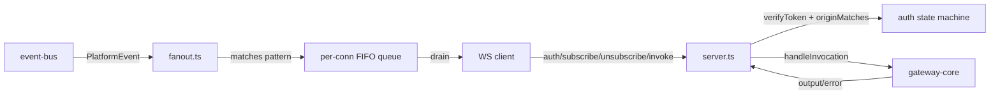

# PRD-TRD: WebSocket Adapter

**Slug:** websocket-adapter
**Status:** Approved
**Date:** 2026-08-03

## Why This Exists

The Gateway's only open data door today is the MCP adapter (request/response over Streamable
HTTP, port 7100). First-party consumers need more: the dashboard v1 (backlog BI[13]) must
render live views without polling, browser SDKs want to hear about things without asking,
and the CLI adapter (backlog row 23) needs one door for reads AND writes. `backend-runtime`
exists, but it speaks the business-SDK protocol (`sdk.auth`, capability registration) — not
a general-purpose door.

The WebSocket adapter is that door: a push channel (`subscribe`/`event`) plus pull
(`invoke`, universal for all v1 clients) over one socket, with the same kernel underneath
as every other adapter. Without it, every first-party consumer hand-builds its own socket
protocol, auth, and backpressure — the exact duplication the adapter layer exists to kill.

## Behavioral Spec

Wire contract v1 is locked (wayfinder map W1–W6, GRILL-websocket-adapter.txt): flat
`{type, ...}` JSON-as-text envelope, UTF-8. 16 frame types — C→S: `auth`, `subscribe`,
`unsubscribe`, `invoke`; S→C: `auth.ok`, `auth.error`, `subscribe.ok`, `subscribe.error`,
`unsubscribe.ok`, `event`, `invoke.result`, `invoke.error`, `invoke.partial`, `invoke.end`,
`stats`, `error`. No JSON-RPC, no `version` field, no session scoping, no kernel-level
streaming (adapter-level only).

### Scenario 1: Connect and origin capture

**Given** a TCP connection accepted at `/ws`
**When** the client opens the socket (browser sends `Origin` header; Node sends none)
**Then** the connection enters `pre-auth`; the upgrade-time `Origin` (or `null` for Node) is
captured for the auth check. Only `auth` frames are processed; every other frame is dropped
silently ("drop, don't punish").

### Scenario 2: Auth success

**Given** a connection in `pre-auth`
**When** the client sends `{type:"auth", token:"<JWT>"}` within 30s (configurable `preAuthTimeoutMs`)
**Then** the token is HS256-verified against the gateway secret; on success the connection
enters `authenticated` and the server replies `{type:"auth.ok", connectionId, claims}`.
Missing/invalid/expired token → `{type:"auth.error", code, message}` then close 1008. Codes:
`token missing`, `token invalid`, `token expired`, `origin mismatch`, `tenant suspended`.

### Scenario 3: Pre-auth timeout

**Given** a connection still in `pre-auth`
**When** 30s elapse with no successful auth
**Then** the server closes with 1008 (`auth timeout`).

### Scenario 4: Origin binding (browser tokens)

**Given** a browser client (Origin present) sending `auth` with a token that carries
`expectedOrigins: string[]`
**When** the Origin is compared to the claim
**Then** it must be an exact match OR a single-label `*.` wildcard, right-anchored
(RFC 6125 §6.4.3): `https://*.acme.com` matches `https://app.acme.com`, NEVER
`https://acme.com` (zero-label), NEVER `https://a.b.acme.com` (multi-label), NEVER
`https://acme.com.evil.com`. Mismatch → `auth.error {code:"origin mismatch"}` + close 1008.
Browser origin with no `expectedOrigins` claim → deny-by-default. Node (no Origin) bypasses
the check. **Note (D-50):** the mint side doesn't emit `expectedOrigins` yet — browser
clients stay denied until the dashboard IMPL lands it; the adapter is the enforcer, not the
mint.

### Scenario 5: Mid-connection refresh

**Given** an authenticated connection
**When** the client sends another `auth` frame with a valid token
**Then** the claims swap atomically in place; subscriptions, in-flight invokes, the outbound
queue, and `connectionId` are carried. In-flight invokes are NOT aborted. The adapter emits
`event.connection.rotated` on the internal bus (NOT relayed to the socket — `event.*` is
reserved). Failure → `auth.error` + close 1008, no fallback.

### Scenario 6: Subscribe

**Given** an authenticated connection
**When** the client sends `{type:"subscribe", topics:["session.*","capability.*"]}`
**Then** each topic must be a valid event-bus pattern (verbatim bus grammar: `*` final
segment only, bare `*` allowed) and NOT start with `event.`; each is authorized at
subscribe time via `checkAuthz(claims.scope, ["platform.<firstSegment>.read"])` (bare `*`
derives `platform.*.read` — operator-grade). Batch is all-or-nothing (first rejected topic
→ `subscribe.error`, nothing applied). Success → `subscribe.ok` echoing the requested
topics (assumption confirmed in pre-impl sim). Idempotent: duplicate topics are deduped,
`subscribe.ok` still echoes them. Violations: `WS_INVALID_TOPIC` (grammar/reserved),
`WS_FORBIDDEN` (authz), `WS_INVALID_FRAME` (non-array/empty).

### Scenario 7: Unsubscribe and prune

**Given** an authenticated connection with subscriptions
**When** the client sends `{type:"unsubscribe", topics:[...]}`
**Then** matching subscriptions are removed; topics never subscribed still return
`unsubscribe.ok` (no error — drop, don't punish). On socket close, all subscriptions are
pruned and the outbound queue cleared.

### Scenario 8: Event fan-out

**Given** an authenticated connection with subscriptions and a bus publish
**When** a `PlatformEvent` (`{name, payload, id, publishedAt}`) is published to the bus
**Then** the adapter relays it to every (connection × matching pattern) as
`{type:"event", topic:name, id, publishedAt, payload}`. `event.*` topics are filtered at
fan-out (defense-in-depth — the bus itself blocks external `event.` publishes, but
bus-internal events like `event.handler_failed` exist). Relay handlers NEVER await
`socket.send` — they enqueue and return (the bus's `Promise.allSettled` dispatch must not
block on a slow socket).

### Scenario 9: Invoke (call mode)

**Given** an authenticated connection
**When** the client sends `{type:"invoke", correlationId, name, input?, sessionId?, mode:"call"|"stream"}`
**Then** the adapter calls `gateway.handleInvocation` with the connection's verified token
and maps the response: `{output}` → `{type:"invoke.result", correlationId, output}`;
`{error:{code,message,details}}` → `{type:"invoke.error", correlationId, code, message, details?}`
— gateway/capability codes pass through verbatim (no third vocabulary). `correlationId` is
echoed on every response. Missing `correlationId`/`name` → `WS_INVALID_FRAME`.

### Scenario 10: Invoke (stream mode)

**Given** a connection invoking a capability with `mode:"stream"`
**Then** the adapter wraps the single-shot kernel call into `invoke.partial` frames
(progress) and terminates with `invoke.end {correlationId}`. Partials ride the same
outbound queue as events (backpressure applies).

### Scenario 11: Backpressure

**Given** a connection whose outbound queue exceeds `maxBufferedBytes` (default 1 MiB)
**When** the client is reading slower than the adapter enqueues
**Then** the adapter drops the OLDEST buffered frames (FIFO — drop oldest, keep newest),
keeps a cumulative monotonic per-connection `dropped` counter, and emits
`{type:"stats", dropped:N}` ~1s after the first drop (`statsIntervalMs` default 1000).
The client diffs and re-pulls snapshots via `invoke`. Whole-connection scope v1; per-topic
is v2.

### Scenario 12: Frame cap

**Given** `maxFrameBytes` (default 1 MiB)
**When** an inbound frame exceeds the cap
**Then** close 1009 (RFC 6455 "message too big") — enforced by the `ws` `maxPayload`
option, zero adapter code.
**When** an outbound frame would exceed the cap
**Then** send `{type:"error", code:"WS_FRAME_TOO_LARGE"}` then close 1009.

### Scenario 13: Heartbeat

**Given** an authenticated connection
**When** the server pings at `heartbeatIntervalMs` (default 30s) and no pong arrives within
`heartbeatTimeoutMs` (default 10s)
**Then** close 1011. Protocol-level ping/pong only (the `ws` library handles it); no
app-level pong frame in v1.

### Scenario 14: Shutdown

**Given** a running adapter
**When** `stop()` is called
**Then** every connection is closed (subs pruned, queues cleared), all bus subscriptions
unsubscribed, the port released — no dangling handlers.

## Simulation Contract

Post-impl sim must drive the REAL `@platform/adapter-websocket` package and demonstrate:

```bash
connect http://localhost:7300  origin=https://app.acme.com    # S1: origin captured
auth <browser-token>                                          # S2/S4: auth.ok + claims
auth <node-token>                                             # S4: Node bypass
send {"type":"subscribe","topics":["session.*","plugin.*"]}   # S6: ok + echo
send {"type":"subscribe","topics":["event.foo","a.*.b"]}      # S6: WS_INVALID_TOPIC
send {"type":"subscribe","topics":["plugin.*"]}               # S6: WS_FORBIDDEN (narrow token)
# bus publish of session.created on the real event-bus
# → event frame relayed to matching socket only
invoke capability.list --stream                               # S9/S10: result/partial/end
# slow consumer + burst publish → stats frame, dropped>0, buffered ≤ 1 MiB  # S11
# send frame > 1 MiB → close 1009                                              # S12
# 30s no activity → ping; no pong → close 1011                                 # S13
```

Each behavioral scenario maps 1:1 to sim commands; the sim asserts the same observable
states the pre-impl sim showed (lifecycle strip, connection KV, sub chips, bus event log,
queue/dropped meters).

## Technical Design

### Data Models

```ts
// ConnectionRecord — one entry per open socket
//   Field naming reflects the shipped implementation (per the drift close-out
//   recorded in .reports/2026-08-03-drift-final-websocket-adapter.md):
//   - `origin` is `string | undefined` (not `null`); the PRD lock used `null`
//     but every other surface in the package uses `undefined` for "absent"
//     (browser upgrade header missing on Node clients).
//   - `state` includes an `open` pre-state for the instant before the pre-auth
//     timer arms and an `auth-error-closed` terminal state for sockets closed
//     after `auth.error` is sent — both are internal-only and never visible
//     to the caller.
//   - `awaitingPong` + `pongTimer` are the W4-sub-Q-4 heartbeat's
//     protocol-level ping/pong bookkeeping; close 1011 on miss.
//   - `closeReason` records the last close reason for diagnostics only.
interface ConnectionRecord {
  readonly id: string;                 // "ws-<n>"
  socket: WebSocket;                   // raw ws socket
  readonly origin: string | undefined;  // upgrade-time Origin; undefined = Node
  state: "open" | "pre-auth" | "authenticated" | "auth-error-closed";
  token: string | null;                // raw JWT for handleInvocation
  claims: TokenClaims | null;          // verified claims (scope for authz)
  subs: Map<string, () => void>;       // pattern → bus unsubscribe handle
  queue: Frame[];                      // outbound FIFO
  bufferedBytes: number;
  dropped: number;                     // cumulative, monotonic
  statsTimer: ReturnType<typeof setTimeout> | null;
  preAuthTimer: ReturnType<typeof setTimeout> | null;
  heartbeatTimer: ReturnType<typeof setTimeout> | null; // ping deadline
  pongTimer: ReturnType<typeof setTimeout> | null;     // pong deadline
  awaitingPong: boolean;
  closeReason: string | null;         // diagnostic only
}
```

Wire frames: `event` = `{type, topic, id, publishedAt, payload}` (bus `PlatformEvent`
identity, so clients dedup across resync); `stats` = `{type, dropped}`; `error` =
`{type, code, message}`. Error vocabulary: WS-native `WS_INVALID_TOPIC` /
`WS_FORBIDDEN` / `WS_INVALID_FRAME` / `WS_INTERNAL` / `WS_FRAME_TOO_LARGE`; auth uses the
lowercase phrase codes; invoke passes gateway/capability codes through.

### API Contracts

```ts
// packages/adapter-websocket/src/index.ts
interface WebSocketAdapterConfig {
  host?: string;                    // default 127.0.0.1
  port?: number;                    // default 7300 (MCP=7100, dashboard=7200 — confirmed 2026-08-03)
  tokenSecret: Uint8Array;          // same gateway JWT secret (verifyToken)
  clock?: Clock;                    // default real clock
  maxBufferedBytes?: number;        // default 1_048_576 (W6)
  maxFrameBytes?: number;           // default 1_048_576 (W4 sub-Q 5)
  statsIntervalMs?: number;         // default 1000 (W6 sub-Q 4)
  preAuthTimeoutMs?: number;        // default 30_000 (W2 sub-Q 2)
  heartbeatIntervalMs?: number;     // default 30_000 (W4 sub-Q 4)
  heartbeatTimeoutMs?: number;      // default 10_000 (W4 sub-Q 4)
}
// createWebSocketAdapter(gateway: Gateway, eventBus: EventBus, cfg): Adapter
// implements Adapter {name: "adapter-websocket", start(), stop()}
```

Auth: `verifyToken(token, clock, secret)` from gateway-core; claims carry
`expectedOrigins?` (D-50 pending mint). Authz: `checkAuthz(claims.scope, [derived])` from
gateway-core (`platform.<first>.read`; bare `*` → `platform.*.read`). Invoke:
`gateway.handleInvocation({token, capability:{name}, input, sessionId})` — the kernel
re-verifies the token; `caller` is not passed (kernel derives from claims).

### Dependencies

- `ws` ^8.18.0 — runtime (same version backend-runtime ships; server `maxPayload`,
  `ping`/`pong`, upgrade `Origin` via `req.headers.origin`). No opensrc fetch needed:
  already vendored + used in-tree.
- `@platform/event-bus` — runtime (subscribe/publish, `matches`, `validatePattern`,
  `PlatformEvent`).
- `@platform/gateway-core` — runtime (`verifyToken`, `checkAuthz`, `Adapter`,
  `CanonicalInvocation`/`CanonicalResponse`, `Clock`, `TokenClaims`).
- devDeps mirror backend-runtime: `@types/node`, `@types/ws`, `typescript`, `vitest`,
  `eslint` + `@typescript-eslint/*`.

### Architecture Notes

Module layout (per W5 proposal): `src/server.ts` (createWebSocketAdapter — socket
lifecycle, auth, pre-auth/heartbeat timers, `start`/`stop`), `src/registry.ts`
(ConnectionRegistry — open/close/iterate/prune), `src/fanout.ts` (per-connection
subscription management + event relay + queue enqueue), `src/errors.ts` (WS_* codes),
`src/index.ts` (re-exports).

Data flow:



Fan-out: per (connection × pattern) `eventBus.subscribe(pattern, handler)`; the handler
enqueues a frame and returns immediately (never awaits `socket.send` — the bus dispatches
with `Promise.allSettled`). Unsubscribe is idempotent and safe mid-dispatch. Backpressure:
enqueue loops while `bufferedBytes > maxBufferedBytes` shifting the queue head; the
`stats` timer is armed only when `dropped > 0` (resets after emit). Heartbeat: interval
pings; a pong resets the deadline; no pong within `heartbeatTimeoutMs` → close 1011.
`stop()`: snapshot registry, unsubscribe every bus handle, close sockets, clear timers.

agentide wiring: `createPlatform` gains `adapterWs?: boolean` (default ON like MCP) +
`wsPort?: number` (default 7300); CLI opts out (`adapterWs: false` — short-lived
process, port-binding race, same reason it opts out of MCP). Start order: gateway →
backend-runtime → ws adapter; stop in reverse. The adapter reuses the same bootstrapped
secret bytes the gateway + backend-runtime share.

## Non-Goals

- **No JSON-RPC / MCP envelope** — locked W1 sub-Q 4; the two products keep their shapes.
- **No session scoping of subscriptions** — v1, tenant is the process boundary (W3 sub-Q 4).
- **No per-topic backpressure** — whole-connection v1; per-topic deferred (W6 sub-Q 5).
- **No app-level pong/ping frames** — protocol-level only (W4 sub-Q 4; future.md revised).
- **No reconnect logic** — client concern (sdk-node/sdk-browser own their retry policy).
- **No TLS/self-host concerns** — binds 127.0.0.1 like the other adapters; TLS is a
  deployment/rev-proxy decision.
- **No origin minting** — the adapter enforces `expectedOrigins`; the mint side is
  D-50 (dashboard IMPL, gateway-core `issueToken` + CLI flags).

## Out of Scope (Future)

- URL-path versioning (`/ws` → `/ws/v2`) when the envelope needs breaking changes (W4 sub-Q 6).
- Kernel-level streaming seam + `invoke.batch` + MCP-shape compat — future.md backlog.
- Per-topic backpressure and `event.connection.rotated` relay to clients (v2).

## References

- `docs/features/websocket-adapter/GRILL-websocket-adapter.txt` — 23 locked Q&As (W1–W6)
- `docs/wayfinder/websocket-adapter/map.md` — decision log (COMPLETE) + `future.md`
- `docs/CONTEXT.md` — glossary (Adapter, capability, permission tier, PlatformEvent…)
- `docs/drift.md` — D-50 open (expectedOrigins minting; this adapter is the enforcer)
- `packages/event-bus/src/match.ts` — `matches`, `validatePattern`
- `packages/gateway-core/src/authz.ts` — `checkAuthz`; `src/auth.ts` — `verifyToken`
- `packages/backend-runtime/src/server.ts` — in-tree `ws` server precedent
- `docs/features/websocket-adapter/simulate-pre.html` — approved pre-impl sim (design
  assumptions it confirmed: subscribe.ok echo, all-or-nothing batch, stats ~1s, single-label
  wildcard)
