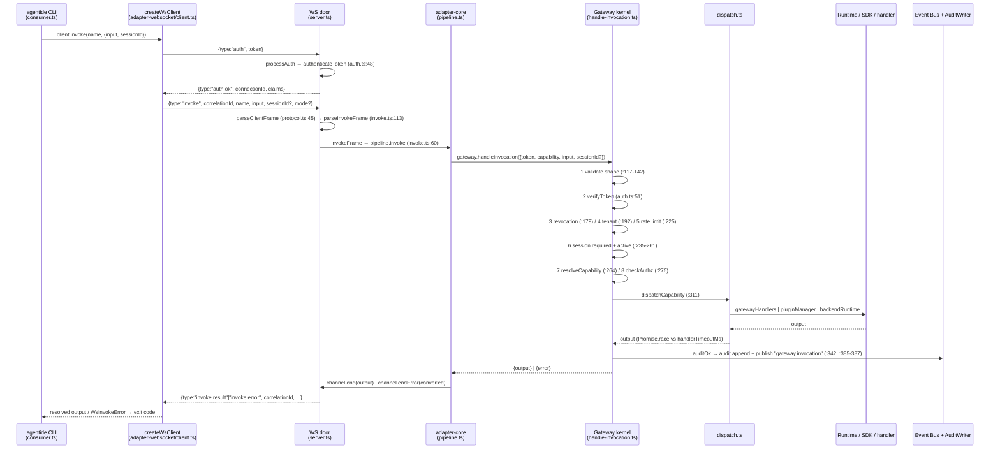

# REST adapter — platform discovery report

> Research for A9-R1 (the REST adapter's discovery gate). Citations as `file:line`.
> Decisions are A9's job — this is the input.
>
> **Method:** read-only trace of the shipped code, cross-checked against the locked docs.
> Where doc and code disagree, the divergence is flagged (§14), never silently resolved.
> Paths are relative to the repo root `/home/spanexx/Shared/Learn/Agent-Bridge-SDK/agentide/`.

---

## 0. Reading notes (path corrections)

The A9-R1 ticket names four files that do not exist at the given paths. Actual locations:

| Ticket says | Actually at |
|---|---|
| `packages/adapter-core/src/claims.ts` | `packages/adapter-core/src/read-claims.ts` |
| `packages/adapter-core/src/registry.ts` | `packages/adapter-core/src/record-registry.ts` |
| `packages/adapter-core/src/capability-lookup.ts` | `packages/adapter-core/src/capabilities/lookup.ts` |
| `packages/agentide/src/oauth-token-handler.ts` | `packages/gateway-core/src/oauth-token-handler.ts` |

The last one matters for A9: the OAuth token handler is **kernel-owned**, not CLI-owned
(`packages/gateway-core/src/oauth-token-handler.ts:51`), and is exposed to adapters as a
plain function through `Gateway.oauthTokenHandler` (`packages/gateway-core/src/types.ts:245`).
A REST door would consume it exactly as the MCP door does — it does not need its own copy.

---

## 1. Platform architecture

**Gateway.** The kernel entry point is `handleInvocation(req, ctx)`
(`packages/gateway-core/src/handle-invocation.ts:110`), a nine-stage pipeline documented at
`:96-109`: validate shape → verify JWT → active-revocation check → tenant state → tenant
isolation → rate limit → session requirement/status → capability version resolve → authz →
dispatch → audit+event. Its public face is the `Gateway` interface
(`packages/gateway-core/src/types.ts:231-264`). The header comment at
`handle-invocation.ts:109` states the contract for this effort verbatim: *"Used by: every
adapter (MCP / REST / CLI / WS) translates inbound requests into a CanonicalInvocation and
calls this."* Capability routing happens in `dispatchCapability`
(`packages/gateway-core/src/dispatch.ts:47`), keyed on the record's `owner` field.

**Adapter.** Defined in the glossary (`docs/CONTEXT.md`, Adapter row) as *"a pure protocol
translator at the edge — maps a transport's native protocol (MCP, WebSocket, CLI, REST) onto
the canonical Capability Invocation packet and back. No business logic."* The kernel-side
interface is `Adapter` (`packages/gateway-core/src/types.ts:197-201`) — just
`name`/`start()`/`stop()`. The A1 lock (`docs/wayfinder/adapter-core/map.md:90`) sets the
boundary rule: *"'own bytes' rule: parse/render stay in the door, everything between is
shared… doors import ONLY adapter-core."* The shared seam is `createAdapterPipeline`
(`packages/adapter-core/src/pipeline.ts:58`).

**Runtime.** An execution environment owning its own resources (`docs/CONTEXT.md`, Runtime
row). Two dispatch paths exist: plugin runtimes via `pluginManager.handleInvocation`
(`dispatch.ts:110`) for `plugin:<id>` owners, and business SDKs via
`backendRuntime.dispatchInvocation` (`dispatch.ts:134`) for `backend-sdk-*` owners. There is
no separate "runtime registry" package — the registry is the capability registry plus the
plugin manager's install records.

**Capability.** The data model is `CapabilityRecord`
(`packages/capability-registry/src/types.ts:44-55`): `name`, `version`, `type`,
`description`, optional `inputSchema`/`outputSchema`, `permissions`, `owner`, optional
`tier`. The registry contract is exactly four methods plus `removeByOwner`
(`packages/capability-registry/src/types.ts:108-116`).

**Session.** Lifecycle `active | suspended | archived`
(`packages/session-manager/src/types.ts:39`); manager interface at `:134-149`. The
session-less set is `SESSION_LESS_CAPABILITIES`
(`packages/gateway-core/src/handle-invocation.ts:48-65`) — 16 names, enumerated in §6.

**Plugin.** Manifest shape and lifecycle are documented in `docs/CONTEXT.md` (Plugin
Manifest row: top-level `runtime:` / `service:` / `developer:` key naming the type and
carrying the id). Kernel-side, plugin owners are routed at `dispatch.ts:80-121`, with
install/enabled pre-checks at `:86-100` producing `GATEWAY_PLUGIN_NOT_INSTALLED` /
`GATEWAY_PLUGIN_DISABLED`.

**Event Bus.** Interface created by `createEventBus()` (`packages/event-bus/src/index.ts:76`),
exposing `publish` + `subscribe` (`:250`). The reserved-namespace rule is enforced in
`publish` (`:142-145`): any name starting with `RESERVED_INTERNAL_PREFIX` (`event.`) throws —
only the bus itself may publish there, via the separate `publishInternalEvent` escape hatch
(`:44-51`).

---

## 2. Invocation flow

Traced call: `agentide invoke <capability>` from the CLI consumer over the WebSocket door.

Call sites, in order:

| Step | Function | `file:line` |
|---|---|---|
| CLI invoke | `client.invoke(...)` | `packages/agentide/src/consumer.ts:281` |
| Frame parse | `parseClientFrame` | `packages/adapter-websocket/src/protocol.ts:45` |
| Invoke parse | `parseInvokeFrame` | `packages/adapter-websocket/src/invoke.ts:113` |
| Door → core | `invokeFrame` → `pipeline.invoke` | `packages/adapter-websocket/src/invoke.ts:60` |
| Core seam | `createAdapterPipeline().invoke` | `packages/adapter-core/src/pipeline.ts:63-83` |
| Kernel | `handleInvocation` | `packages/gateway-core/src/handle-invocation.ts:110` |
| Token verify | `verifyToken` | `packages/gateway-core/src/auth.ts:51` |
| Authz | `checkAuthz` | `packages/gateway-core/src/authz.ts:56` |
| Dispatch | `dispatchCapability` | `packages/gateway-core/src/dispatch.ts:47` |
| Audit + event | `auditOk` / `auditError` / `exitWithError` | `handle-invocation.ts:367`, `:390`, `:421` |
| Render back | `wsSink` | `packages/adapter-websocket/src/invoke.ts:75-107` |

Note the pipeline builds the canonical packet at `pipeline.ts:65-71` and deliberately
preserves explicit `null` input, defaulting only on `undefined` (`:69`).

---

## 3. WebSocket adapter (the model for REST)

**3.1 How it starts.** `createWebSocketAdapter(gateway, eventBus, config)`
(`packages/adapter-websocket/src/server.ts:42`) returns an `Adapter`-shaped handle
(`:268-274`). `start()` binds a `WebSocketServer` on `path: "/ws"` with `maxPayload`
(`:62`). Defaults: host `127.0.0.1`, port `7300` (`:47-48`, constants at
`types.ts:32-41`). Composition root wiring is in `packages/agentide/src/factory.ts:228-234`,
which decodes the base64 `gateway-secret` into `tokenSecret` at `:227`.

**3.2 How it authenticates.** JWT-in-first-message (W2 lock). Per-connection state machine
`open → pre-auth → authenticated | auth-error-closed` (`types.ts:64-68`). A pre-auth timer
(default 30 s, `server.ts:53`) closes 1008 on expiry (`:101-103`). Non-`auth` frames before
authentication are silently dropped (`:119-122` — the "drop, don't punish" rule). `processAuth`
(`:145`) calls `authenticateToken` (`auth.ts:48`), which now delegates to adapter-core's
`createAuthPolicy({mode:"early"})` (`auth.ts:46,49`) and maps canonical reasons to the five
lowercase wire phrases in `AUTH_ERROR_CODES` (`types.ts:232-238`). Refresh is supported
mid-connection: `auth` is accepted in the authenticated state (`server.ts:123-126`), swaps
claims in place, and publishes `event.connection.rotated` (`:170-177`).

**3.3 How it finds capabilities.** It does **not**. Per the A6 lock, `createCapabilityLookup`
ships unwired — there is no discovery frame; `capability.list` is reached through an ordinary
`invoke` frame (`docs/wayfinder/adapter-core/future.md:52-56`). Verified: no import of the
lookup anywhere in `packages/adapter-websocket/src/`.

**3.4 How it builds an invocation.** `invokeFrame` (`invoke.ts:44`) constructs a
`PipelineInvocation` (`:60-67`) and hands the A4 sink factory in at `:57`. The canonical
packet itself is assembled inside adapter-core (`pipeline.ts:65-71`).

**3.5 How it talks to the Gateway.** In-process, one call: `gateway.handleInvocation(...)` at
`packages/adapter-core/src/pipeline.ts:65`. The door never calls the kernel directly any more
(post-A7); the only remaining direct kernel call in the door is `gateway.listTenants` passed
as a callback for tenant-state checks (`server.ts:151`).

**3.6 How it returns errors.** A5 envelope + door table. The WS converter is an identity
passthrough — gateway codes ride the wire verbatim (`invoke.ts:29-35`), which is a *rendering
policy*, not a table entry. Adapter-native codes are the five `WS_ERROR_CODES`
(`errors.ts:23-29`). Close codes: `1008` auth (`server.ts:38`), `1009` oversized frame
(`:39`), `1011` heartbeat (`:40`). Internal throws render `WS_INTERNAL` from the door's own
try/catch (`invoke.ts:68-70`).

**3.7 How it creates sessions.** It does not — A3 pass-through. `sessionId` is optional on the
invoke frame (`types.ts:133`), forwarded only when defined (`pipeline.ts:70`), and the kernel
owns the verdict via `SESSION_LESS_CAPABILITIES` (`handle-invocation.ts:235-244`). Session
minting lives at the consumer edge (`packages/agentide/src/consumer.ts:284-286`).

**3.8 How it subscribes to events.** `subscribe`/`unsubscribe` frames (`server.ts:131-141`)
route to `subscribeTopics` (`fanout.ts:48`). Validation is all-or-nothing: grammar via the
bus's own `validatePattern` (`:61`), reserved-namespace rejection (`:65-67`), then per-pattern
authz using the derived permission `platform.<firstSegment>.read` (`derivePermission`,
`:37-40`) checked with the same `checkAuthz` as invocations (`:68`). One `bus.subscribe` per
(connection × topic) (`:76`). The relay handler never awaits `socket.send` — it enqueues and
returns (`:87`), because bus dispatch awaits `Promise.allSettled` and a slow socket would
back-pressure the bus (`:44-47`). Backpressure is the door's own 1 MiB FIFO drop-oldest queue
(`queue.ts:59-77`) with a one-shot `stats` frame after the first drop (`:121-127`).

---

## 4. Gateway API exposed to adapters

| Concern | Surface | `file:line` |
|---|---|---|
| Invoke | `handleInvocation(req: CanonicalInvocation): Promise<CanonicalResponse>` | `packages/gateway-core/src/types.ts:232` |
| Adapter lifecycle | `registerAdapter` / `unregisterAdapter` | `types.ts:233-234` |
| Token mint | `issueToken(req): {token, claims}` | `types.ts:235` |
| Tenants | `createTenant` / `listTenants` / `suspendTenant` / `deleteTenant` | `types.ts:236-239` |
| Status | `status(): GatewayStatus` | `types.ts:240` |
| OAuth | `oauthTokenHandler?` (optional, adapters route `POST /oauth/token` to it) | `types.ts:245` |
| OIDC | `oidc?.authorize` / `oidc?.callback` | `types.ts:251-258` |
| Client identities | `clientService` | `types.ts:263` |

**Sessions** are not a distinct API — they are ordinary capabilities (`session.create`,
`session.resume`, `session.touch`, `session.list` are all in the session-less set,
`handle-invocation.ts:49-52`); `session.destroy` is deliberately *not* in that set and
requires an active session.

**Permissions** are checked by `checkAuthz(callerScope, requiredPermissions)`
(`packages/gateway-core/src/authz.ts:56`). Rules: bare `*` covers everything (`:60`);
rank-null-on-both-sides means exact string match, i.e. business caps (`:64-67`); otherwise
same kind + same namespace + caller rank ≥ required rank (`tierCovers`, `:77-97`), with the
namespace wildcard `platform.*.<tier>` handled at `:88-90`. Ranks: runtime read/act/destructive
= 1/2/3, platform read/write = 1/2 (`rank`, `:24-41`).

**Audit** is written by `AuditWriter.append` (`packages/gateway-core/src/audit.ts:23`) —
append-only JSON lines, best-effort, never throws (`:30-35`). Every exit path emits both the
audit record and the `gateway.invocation` bus event: success `handle-invocation.ts:385-386`,
error `:411-412`, pre-verify denial `:441-442`.

**Events** are emitted by the kernel only. adapter-core emits nothing (A1 lock,
`packages/adapter-core/src/pipeline.ts:14`).

**Runtimes** are located by owner prefix in `dispatchCapability` (`dispatch.ts:69-154`):
`gateway`/`session-manager`/`plugin-manager`/`capability-registry`/`platform-*` → in-process
handler map (`:69-79`); `plugin:*` → plugin manager (`:80-121`); `backend-sdk-*` → backend
runtime (`:122-141`); otherwise a final fallback consults the extra-owner handler map before
throwing (`:146-154`). A `Promise.race` enforces `handlerTimeoutMs` (`:156-171`).

---

## 5. Authentication

**JWT verification.** `verifyToken(token, clock, secret, options)`
(`packages/gateway-core/src/auth.ts:51`). HS256 only, with an explicit algorithm-confusion
guard (`:65-67`), timing-safe signature compare (`:82`), and expiry check with optional leeway
(`:93`). Failure returns a discriminated union carrying `GATEWAY_TOKEN_INVALID` or
`GATEWAY_TOKEN_EXPIRED`. Minting is `issueToken` (`:35`).

**Claims shape.** `TokenClaims` (`packages/gateway-core/src/types.ts:117-123`):
`sub: {tenantId, callerId}`, `scope: string[]`, optional `expectedOrigins: string[]`, `iat`,
`exp`. Note `exp` is compared directly against `clock.now()` (`auth.ts:93`), i.e. **epoch
milliseconds**, not the RFC 7519 seconds convention.

**Kernel is the trust boundary.** `CanonicalInvocation.token` is required; `caller` is optional
and, if supplied, must agree with the verified claims or the request is rejected with
`GATEWAY_AUTH_FAILED` (`handle-invocation.ts:156-165`; contract documented at `types.ts:58-61`).

**OAuth.** `handleTokenRequest` (`packages/gateway-core/src/oauth-token-handler.ts:53`)
supports two grants: `client_credentials` and `registration_code` (`:61-66`), returns
`unsupported_grant_type` 400 otherwise. TLS is required unless explicitly disabled — plain
HTTP returns **426** (`:54-59`). The adapter-facing shape is deliberately minimal:
`OAuthTokenRequest {body, isTls}` (`:47-50`), so a REST door only has to parse a body and
determine TLS. The MCP door's implementation of exactly that is at
`packages/adapter-mcp/src/server.ts:172-204` (JSON *or* form-encoded body at `:181-186`,
`x-forwarded-proto` handling at `:192-196`).

**Permission scopes.** See §4 (`authz.ts:56`).

**Origin binding.** `originMatches` (`packages/origin/src/index.ts:9`, re-exported through
gateway-core). Applied inside the shared auth policy
(`packages/adapter-core/src/auth-policy.ts:79-82`): the claim defaults to `[]` when absent,
and an empty allowlist fails deny-by-default for any present Origin. Node clients that send no
Origin bypass the check (this is inside `originMatches`). **Relevant to A9:** origin binding is
enforced only on the *early* path — a lazy-mode door gets no origin check at all today,
because the kernel's `handleInvocation` never consults `expectedOrigins` (searched: no
reference in `handle-invocation.ts`).

**Bearer extraction precedent** (the only one in the codebase):
`packages/adapter-mcp/src/server.ts:44-48`, a case-insensitive `^Bearer\s+(.+)$` match, carried
per-request through `AsyncLocalStorage` (`:38`, read at `:40`, set at `:241-242`).

---

## 6. Sessions

**Lifecycle.** `SessionStatus = "active" | "suspended" | "archived"`
(`packages/session-manager/src/types.ts:39`). Interface: `create` / `resume` / `touch` /
`destroy` / `getStatus` / `list` / resource attach-detach-list
(`packages/session-manager/src/types.ts:134-149`).

**Timeouts.** `DEFAULT_IDLE_TIMEOUT_MS = 300_000` (5 min) and
`DEFAULT_SUSPENDED_TTL_MS = 1_800_000` (30 min) — `packages/session-manager/src/index.ts:30-31`;
per-session override read at `:112`, archive TTL at `:156`. This matches CONTEXT.md's stated
"5 min idle → Suspend, 30 min TTL → Archive".

**Session-less set** — the exact 16 names (`packages/gateway-core/src/handle-invocation.ts:48-65`):
`session.create`, `session.resume`, `session.touch`, `session.list`, `capability.list`,
`capability.describe`, `plugin.list`, `gateway.status`, `gateway.metrics`,
`gateway.configuration`, `tenant.list`, `system.info`, `system.version`, `system.health`,
`auth.token.issue`, `auth.token.revoke`. Composition roots may extend the set via
`sessionLessCapabilities` (`:86`, consulted at `:236`) — the seam dashboard-core uses.

**Ownership.** The session manager owns the records; the Gateway owns the verdict. The kernel
requires a session for anything outside the set (`:237-244`) and additionally requires the
session be **active** — `suspended`/`archived`/missing all collapse to
`GATEWAY_SESSION_REQUIRED` (`:245-261`). A thrown lookup is swallowed into `null` (`:249-251`).

**Adapter passthrough.** A3: no sessionId → forward `undefined`, no synthesis
(`packages/adapter-core/src/pipeline.ts:70`).

---

## 7. Capabilities

**Registration.** `register(owner, manifest)` replaces the owner's whole map and returns a
diff (`packages/capability-registry/src/types.ts:109-112`, `RegisterResult` at `:80-84`).
Platform caps are registered by `registerPlatformCapabilities` (25 caps under their real
owners, per the CONTEXT.md decisions log).

**Search / list.** `capability.list` is a kernel handler
(`packages/gateway-core/src/factory.ts:554-570`). It filters the catalog by the caller's
scope via `checkAuthz` (`:568`) — and critically, **the scope comes from the request `input`,
not from the verified token**: `const i = (input ?? {}) as {scope?}` (`:559-560`), with an
empty scope returning `[]` defensively (`:562`). That is why both doors pass
`{scope: readClaims(token).scope}` (adapter-core `capabilities/lookup.ts:59-65`; MCP
`translate.ts:142`). Operators pass `["*"]` for the full view.

**Metadata fields.** `CapabilityRecord` — `name`, `version`, `type`, `description`,
`inputSchema?`, `outputSchema?`, `permissions`, `owner`, `tier?`
(`packages/capability-registry/src/types.ts:44-55`). The compact list form is
`CapabilityCard` — `name`, `version`, `type`, `description`, `tier`
(`:58-64`), produced by `allCards()` (`packages/capability-registry/src/store.ts:69-80`).

**Versioning.** Auto-latest by default, explicit pin supported:
`resolveCapability` calls `registry.describe(name)` or `describe(name, version)`
(`packages/gateway-core/src/dispatch.ts:238-249`); the resolved version is what lands in the
audit record (`handle-invocation.ts:380`).

**Types / tiers.** `CapabilityType = business | platform | runtime`
(`capability-registry/src/types.ts:30`); `CapabilityTier = read | act | destructive | write`
(`:35`), with `RUNTIME_TIERS` / `PLATFORM_TIERS` / `ALL_TIERS` at `:37-39`.

**Schema validation.** The kernel validates input against `inputSchema` before dispatch
(`handle-invocation.ts:291-310`) and output against `outputSchema` after
(`:320-339`) — input failure is `GATEWAY_INVALID_REQUEST` (retryable false), output failure is
`GATEWAY_INTERNAL_ERROR` (retryable **true**, `:335`). A REST door gets 400-worthy validation
for free; it does not need its own schema layer.

---

## 8. Error model

**Envelope.** `GatewayErrorPayload {code, message, details, retryable}` — defined twice, on
purpose: `packages/errors/src/index.ts:19-24` (details typed as
`GatewayErrorDetailValue`) and re-tightened to `YamlValue` at the gateway-core boundary
(`packages/gateway-core/src/types.ts:75-80`, rationale at `:72-74`). adapter-core re-exports
the `@spanexx/errors` version (`packages/adapter-core/src/index.ts:18-19`).

**Catalog.** 18 stable `GATEWAY_*` codes in `ERROR_CODES`
(`packages/errors/src/index.ts:36-55`): `AUTH_FAILED`, `TOKEN_INVALID`, `TOKEN_EXPIRED`,
`INSUFFICIENT_SCOPE`, `UNAUTHORIZED_OPERATION`, `SESSION_REQUIRED`, `RATE_LIMIT_EXCEEDED`,
`CAPABILITY_NOT_FOUND`, `PLUGIN_NOT_INSTALLED`, `PLUGIN_DISABLED`, `SDK_UNREACHABLE`,
`MANAGER_UNAVAILABLE`, `HANDLER_TIMEOUT`, `HANDLER_NOT_FOUND`, `HANDLER_ERROR`,
`INTERNAL_ERROR`, `TENANT_MISMATCH`, `INVALID_REQUEST`.

**Shared converter.** `createErrorConverter({table, defaultError})`
(`packages/adapter-core/src/error-converter.ts:50`). Table entries may be static or a function
of the payload (`:29`). The shared fallback is MCP's: `{code: -32006, message:
"${code}: ${message}"}` (`:45-48`). `DoorError.code` is `string | number` (`:23-27`) so both
string-code and JSON-RPC-numeric doors fit.

**Per-adapter tables.**
- WS: no table at all — identity passthrough via `defaultError`
  (`packages/adapter-websocket/src/invoke.ts:29-35`), plus five adapter-native `WS_*` codes
  (`errors.ts:23-29`).
- MCP: `gatewayErrorToJsonRpc` (`packages/adapter-mcp/src/error-map.ts:30-58`) maps to
  `-32001..-32006`; `GATEWAY_HANDLER_TIMEOUT` is deliberately *not* mapped here — `callTool`
  turns it into an `isError:true` result instead (`translate.ts:215-223`, noted at
  `error-map.ts:5-6`).

**HTTP status mapping.** **None exists.** No adapter maps gateway codes to HTTP status codes
today — confirmed by reading both doors. The only HTTP statuses in the codebase are transport
concerns: 404 for unknown paths (`adapter-mcp/src/server.ts:138`,
`dashboard-core/src/server.ts:120`), 500 for handler crashes
(`adapter-mcp/src/server.ts:201`, `:245`; `dashboard-core/src/server.ts:123`), and the OAuth
family — 426 TLS-required, 400 bad grant/body
(`gateway-core/src/oauth-token-handler.ts:54-66`; `adapter-mcp/src/server.ts:188`). This is
squarely A9's WIP, exactly as the ticket predicted (`A9-R1…md:98-99`).

---

## 9. Event Bus

**Does the Gateway emit events?** Yes — exactly one, on every exit path:
`gateway.invocation`, carrying the same record shape as the audit line
(`handle-invocation.ts:386`, `:412`, `:442`). The record shape is `AuditRecord`
(`packages/gateway-core/src/types.ts:91-104`).

**Does the adapter need lifecycle events?** No — A1 lock: adapter-core emits nothing
(`packages/adapter-core/src/pipeline.ts:14`; `future.md:83`). The WS door does publish one
internal event, `event.connection.rotated`, but only through the bus's internal escape hatch
(`server.ts:171`, using `publishInternalEvent` from `event-bus/src/index.ts:44`).

**Subscription patterns.** Prefix wildcards: `*` only as the final segment, bare `*` matches
everything (CONTEXT.md Event row). Grammar validation is reused from the bus itself
(`validatePattern`, used at `fanout.ts:61`) so client and server agree. Authorization is
per-pattern at subscribe time, derived as `platform.<firstSegment>.read` (`fanout.ts:37-40`).

**Reservation rule.** `event.*` is bus-internal. Enforced twice: rejected at subscribe
(`fanout.ts:65-67`) and filtered again at fan-out (`:79`) as defense-in-depth; the bus itself
throws on public publish attempts (`event-bus/src/index.ts:142-145`).

---

## 10. Existing adapters — duplication inventory post-A7

A11's baseline (branch `research/adapter-core-a11`, commit `345535f`,
`docs/wayfinder/adapter-core/research/A11-duplication-inventory.md`, not merged to `main`):
16 duplicated pipeline files / 2,222 lines / 14 test files / 2 sims.

**Post-A7 state — verified by reading the imports:**

WS has migrated. Three files delegate to adapter-core:

| WS file | Delegates | `file:line` |
|---|---|---|
| `auth.ts` | `createAuthPolicy({mode:"early"})` | `packages/adapter-websocket/src/auth.ts:14,46` |
| `invoke.ts` | `createAdapterPipeline` + `createErrorConverter` | `packages/adapter-websocket/src/invoke.ts:20,54` |
| `registry.ts` | `RecordRegistry<T>` | `packages/adapter-websocket/src/registry.ts:23,39` |

**MCP had NOT migrated** as of the commit this report was written against (`63339bb`):
`grep -rn "adapter-core" packages/adapter-mcp/` returned **nothing** — no source import, no
package.json dependency. A8 was decision-locked but unbuilt (the ticket carries
`delivery: feature-pipeline`, `A8-mcp-migration.md:7`).

> **Note (live):** while this report was being written, A8 migration step 1 (the
> `readClaims` claims swap) began landing in the working tree — `translate.ts`,
> `package.json`, `tsconfig.json`. Rows below marked ⏳ are the ones that step addresses.
> Everything else in this table was still outstanding at the time of writing.

Concretely, MCP still carries:

| Still in the MCP door | What core already provides | `file:line` |
|---|---|---|
| `decodeScopeFromToken` ⏳ | `readClaims` | `packages/adapter-mcp/src/translate.ts:54-73` vs `packages/adapter-core/src/read-claims.ts:30` |
| Direct `handleInvocation` in `listTools` | `createCapabilityLookup.list` | `translate.ts:139-154` vs `capabilities/lookup.ts:58-71` |
| Direct `handleInvocation` in `callTool` | `createAdapterPipeline.invoke` | `translate.ts:213` vs `pipeline.ts:65` |
| `gatewayErrorToJsonRpc` used directly | `createErrorConverter` + table | `error-map.ts:30` vs `error-converter.ts:50` |
| Per-call verify (lazy) | lazy mode **not implemented** — see §14 | `auth-policy.ts:64-89` |

**Legitimately door-local and expected to stay** (A8 resolution items 2a–2d,
`A8-mcp-migration.md:19-25`): the HTTP transport server, MCP-shaped rendering, the error
table, and the OAuth/OIDC routes. The A8 ticket says explicitly of the OAuth routes: *"NOT
shared; REST will have its own"* (`:23-24`) — direct guidance for A9.

**Test surfaces** (the zero-edit acceptance bars): MCP 4 files
(`packages/adapter-mcp/src/__tests__/`: `harness.ts`, `scenarios.test.ts`, `server.test.ts`,
`translate.test.ts`); WS 10 files (`packages/adapter-websocket/src/__tests__/`); adapter-core
7 files (`packages/adapter-core/src/__tests__/`). Sims live in
`packages/agentide/scripts/` (`simulate-mcp-adapter.mjs`, `simulate-websocket-adapter.mjs`,
plus 6 others); the adapter-core sim is `docs/features/adapter-core/simulate.sh`.

**Out of scope, still duplicated:** `packages/backend-runtime/src/verify.ts` — a deliberate
81-line file-level copy of `verifyToken`, header comment "Logic MUST stay in sync"
(`packages/backend-runtime/src/verify.ts:6-8`); map.md defers it (`map.md:45-48`).

---

## 11. REST API surface — existing HTTP endpoints

Exhaustive: three HTTP servers exist. (`grep -rn "createServer|WebSocketServer|\.listen("`
across `packages/*/src`, excluding tests.)

**A. MCP adapter** — `packages/adapter-mcp/src/server.ts:113`, port default 7100
(`packages/adapter-mcp/src/index.ts:42`).

| Method | Path | Handler | Behavior |
|---|---|---|---|
| POST | `/oauth/token` | `handleOAuthTokenRoute` | `server.ts:117-120`, impl `:172-204`. JSON or form body (`:181-186`); TLS via socket or `x-forwarded-proto` (`:192-196`); delegates to `Gateway.oauthTokenHandler`. Only mounted when `config.oauth` is defined. |
| GET | `/oauth/authorize` | `config.oidc.authorize` | `server.ts:126-130` |
| GET | `/oauth/callback` | `config.oidc.callback` | `server.ts:131-135` |
| POST/GET | `/mcp` | MCP Streamable HTTP transport | `server.ts:137-144`; stateless (`sessionIdGenerator: undefined`) with `enableJsonResponse: true` (`:107-110`) |
| any | anything else | 404 | `server.ts:137-141`, JSON-RPC-shaped error body |

OIDC replies are 302-with-`Location` or a JSON error body (`writeOidcResponse`, `:219-230`).

**B. Dashboard static server** — `packages/dashboard-core/src/server.ts:78`, port default 7200
(`:77`, constant in `config.ts`), bound to `127.0.0.1` (`:131`).

| Method | Path | Behavior |
|---|---|---|
| GET | `/` | `:81-92` — serves `index.html` with a freshly minted `dashboard-bot` token injected per load (`:84-88`) |
| GET | `/assets/*` | `:93-118` — real file serving with a prefix containment check (`:96`), placeholder fallbacks (`:108-117`) |
| any | anything else, **including `/api/*`** | 404 (`:119-121`) |

The "no data API" rule is explicit at `:11-12`: *"the adapter-websocket is the only door."*

**C. WebSocket adapter** — not HTTP: `WebSocketServer` on path `/ws`, port 7300
(`packages/adapter-websocket/src/server.ts:62`).

**D. Backend runtime** — also WebSocket, not HTTP
(`packages/backend-runtime/src/server.ts:277`), host hardcoded to `127.0.0.1`.

**Port map (relevant to A9's default-port question):** MCP 7100, dashboard 7200 (reserved —
`packages/agentide/src/types.ts:141`), WS 7300, backend-runtime configurable (7350 referenced
in `packages/agentide/src/consumer.ts:200`). **No port is allocated for REST.**

---

## 12. Reusable code inventory — the 7 A7 primitives

Public surface: `packages/adapter-core/src/index.ts:18-60`. Package total 503 lines.

| # | Primitive | `file:line` | Exists? | What a REST door needs from it |
|---|---|---|---|---|
| 1 | `readClaims(token)` | `read-claims.ts:30` | ✅ | Same as MCP: read `scope` for the `capability.list` input. Defensive `[]` on malformed input (`:32,38,43,46`). Reads the payload only — no signature check. |
| 2 | `createAuthPolicy` | `auth-policy.ts:64` | ⚠️ partial | A REST door is the archetypal `lazy` consumer (bearer per request, no connection). **The `lazy` branch is not implemented** — see §14.1. Usable today only in `early` mode. |
| 3 | `createErrorConverter` | `error-converter.ts:50` | ✅ | REST supplies its own table. Note `DoorError` has no `retryable` and no HTTP status field (`:23-27`) — an HTTP status table is additive work for A9. |
| 4 | `createResponseChannel` | `response-channel.ts:48` | ✅ | For a unary JSON reply the sink implements `emitResult`/`emitError` and can no-op `emitChunk`/`emitEvent` (interface at `:25-34`). Terminal guarantees enforced at `:52-61`. |
| 5 | `RecordRegistry<T,E>` | `record-registry.ts:28` | ✅ but likely unused | It exists for *per-connection* bookkeeping. Stateless REST has no connections; unless A9 introduces server-side request records, this primitive is not needed. |
| 6 | `createAdapterPipeline` | `pipeline.ts:58` | ✅ | The core seam. Takes `{gateway, errors, response}` (`:40-46`). Note: the A1 contract's `config`/`input`/`output` slots are **not** in the shipped signature — omitted in v1, documented at `:8-13`. |
| 7 | `createCapabilityLookup` | `capabilities/lookup.ts:55` | ⚠️ `list` ok, `describe` broken | `GET /capabilities` would use `list` (works). `describe` returns empty fields against the real kernel — see §14.2. |

**Not provided by core, REST would have to bring:** HTTP server + routing + body parsing
(MCP's equivalent: `adapter-mcp/src/server.ts:113-145`), bearer extraction (precedent
`:44-48`), JSON serialization of the reply, an HTTP status mapping table (§8 — none exists),
and content-type negotiation. Backpressure and subscription primitives remain adapter-local
until a second consumer justifies graduation (`future.md:35-49`) — and REST is explicitly
named there as the likely trigger (`:41-42`).

---

## 13. Architecture proposal draft (input only — A9 decides)

Assembled strictly from precedent; every row is a *question for A9*, not an answer.

**Objective.** Package `@spanexx/adapter-rest` (naming precedent: `@spanexx/adapter-mcp`,
`@spanexx/adapter-websocket`). Factory `createRestAdapter(gateway, config)` returning an
`Adapter`-shaped handle (`gateway-core/src/types.ts:197-201`), matching
`createWebSocketAdapter` (`adapter-websocket/src/server.ts:42`) and `createMcpAdapter`
(`adapter-mcp/src/index.ts:61`). Default port: **unallocated** — 7100/7200/7300 are taken
(§11); 7400 is the obvious next in sequence but is A9's call. Wiring point:
`packages/agentide/src/factory.ts:214-234`, alongside the other two adapters.

**Scope (open questions, per the A9 ticket's six sub-questions).** Route shape
(`POST /invoke` vs per-capability routes); auth (Bearer only vs also client-credentials —
the handler already exists and is transport-agnostic, §5); verb→tier mapping; the HTTP status
table (nothing to inherit, §8); discovery via `GET /capabilities` (blocked on §14.2); and
whether `simulate-rest-adapter.mjs` is in the acceptance bar (8 sims exist as precedent,
`packages/agentide/scripts/`).

**Reused components.** Primitives 1, 3, 4, 6 are ready today. Primitive 2 needs the lazy path
built (§14.1) — which A8 already owns, making A8 a de-facto dependency of A9's auth story.
Primitive 7 needs the describe fix (§14.2) if `GET /capabilities` includes schemas.

**New components (door-local by the A1 "own bytes" rule).** HTTP server + router; request
parser (path/query/body → `PipelineInvocation`); JSON response renderer implementing
`ResponseChannelSink`; the REST error table plus a **new** gateway-code → HTTP-status map;
bearer extraction; and — per the A8 precedent (`A8-mcp-migration.md:23-24`) — its own OAuth
route wiring rather than a shared one.

**Testing strategy.** The two-tier precedent: unit tests in `src/__tests__/` (WS 10 files,
MCP 4) plus a post-impl sim in `packages/agentide/scripts/`. Zero-delta does **not** apply —
this is a new door with no existing behavior to preserve (`A9-rest-proof-adapter.md:23`), so
the acceptance bar must be authored fresh rather than inherited.

---

## 14. Divergences between docs and code — FLAGGED, not resolved

### 14.1 `createAuthPolicy` "lazy" mode does not exist

CONTEXT.md and map.md describe A2 as *"one knob `auth: {mode: "early" | "lazy"}` — one verify
function, two call sites"*, and the A9 ticket's own context line assumes REST uses *"lazy
mode, A2"* (`A9-rest-proof-adapter.md:20-21`).

In the shipped code the mode is accepted and stored (`auth-policy.ts:29,65-66`) but **never
branched on**: `authenticate()` runs the identical eager verify regardless
(`:68-88`). The file's own header admits it: *"'lazy' is the knob for doors that defer
verification to first invoke; v1 behavior is identical for both"* (`:6-8`). The A8 resolution
confirms the lazy path is still to be built (`A8-mcp-migration.md:14-17`, "the shared
package's lazy path gets implemented"), and map.md tracks it as drift D-95.

**Consequence for A9:** REST's assumed auth model is unbuilt. Either A9 depends on A8 landing
first, or REST ships in early mode, or REST passes the token straight through and lets the
kernel verify (which is what "lazy" effectively means and what `handleInvocation` already
does at `handle-invocation.ts:145`). Worth noting the third option needs *no* adapter-core
auth policy at all — with the caveat that it silently drops origin binding (§5).

### 14.2 `createCapabilityLookup.describe()` does not match the kernel's response shape

`extractDescriptor` reads `name` / `description` / `inputSchema` / `tier` from the **top
level** of the output (`capabilities/lookup.ts:106-115`).

The kernel's `capability.describe` handler returns `ctx.registry.describe(i.name)`
(`gateway-core/src/factory.ts:572-578`) — that is a `DescribeResult`, i.e.
`{capability: CapabilityRecord | null, selectedVersion, note?}`
(`capability-registry/src/types.ts:66-70`). `wrap` is a pure JSON round-trip and reshapes
nothing (`factory.ts:371-373`). So the fields adapter-core looks for are one level too high,
and against the real kernel `describe()` returns
`{name:"", description:"", inputSchema:null, tier:null}` for every capability.

MCP's own extractor gets this right — it unwraps `rec["capability"]` first
(`adapter-mcp/src/translate.ts:114-127`).

The unit test does not catch it because its fake gateway returns the *flat* shape the kernel
never produces (`packages/adapter-core/src/__tests__/lookup.test.ts:62-66` and `:83`).

**Consequence:** this is latent (A6 shipped the lookup deliberately unwired,
`capabilities/lookup.ts:8-9`), but it is a live trap for both A8 and A9. It also directly
threatens A8's headline acceptance bar — *"MCP `scenarios.test.ts` + `translate.test.ts` run
with ZERO edits"* — since swapping `listTools` onto the shared lookup would change tool
schemas from real to empty. Note A6's claim of *"byte-identical by construction"*
(CONTEXT.md) does not hold for `describe` as written.

### 14.3 Documented A11 inventory is not on `main`

map.md cites `docs/wayfinder/adapter-core/research/A11-duplication-inventory.md`
(`map.md:92`), but that directory does not exist on `main`. The file lives only on the
unmerged branch `research/adapter-core-a11` (commit `345535f`). Same for A10
(`ccde406`, branch `research/adapter-core-a10`). Anyone following the map's citation from
`main` hits a dead link.

### 14.4 A8 is "closed" in the docs but unbuilt in the code

map.md lists A8 under "Decisions so far" and marks the frontier as A9 only
(`map.md:66-75, 81`); the ticket header says `**closed**`
(`A8-mcp-migration.md:4`). That is consistent for a decision-only lock
(`delivery: feature-pipeline`), but at commit `63339bb` the MCP door still contained every
duplication A8 promises to remove (§10) — step 1 began landing during the writing of this
report. A9 planning that assumes "two doors already fully on adapter-core" would be wrong;
at time of writing it is **one** (WS), with MCP in progress.

### 14.5 CONTEXT.md defines "Adapter" twice, with different text

The glossary table has two `**Adapter**` rows: the long definition (in-process vs wire-side
doors, W1–W6, "the common door is the Invocation model") and a second, terser one — *"Pure
protocol translator (MCP, CLI, REST, WebSocket) — no business logic, no state"*. They do not
contradict, but "no state" sits awkwardly with the WS door's per-connection registry, queue,
and subscription map (`adapter-websocket/src/types.ts:84-101`), which A1 explicitly blessed as
shared adapter bookkeeping (`map.md:90`). For a stateless REST door the terser row is
accurate; for A9's framing the distinction is worth a sentence.

### 14.6 Minor: `exp` units, and `retryable` has no wire home in REST

`TokenClaims.exp` is compared to `clock.now()` in **milliseconds** (`auth.ts:93`), not RFC
7519 seconds. Any REST client library that mints or inspects tokens conventionally will be off
by 1000×. Separately, `GatewayErrorPayload.retryable` (`errors/src/index.ts:23`) has no
representation in `DoorError` (`error-converter.ts:23-27`); WS smuggles it through by passing
the whole payload verbatim, and MCP drops it entirely. A REST door that wants to express
retryability (`Retry-After`, or a body field) has no shared carrier today.

---

## Appendix — files read

Docs: `docs/CONTEXT.md`; `docs/wayfinder/adapter-core/{map.md,future.md}`;
`docs/wayfinder/adapter-core/tickets/{A8-mcp-migration.md,A9-rest-proof-adapter.md,A9-R1-rest-platform-discovery.md,A11-research-duplication-inventory.md}`;
A11 inventory via `git show 345535f`.

Code: `packages/gateway-core/src/{handle-invocation,auth,authz,dispatch,types,audit,factory,oauth-token-handler}.ts`;
`packages/adapter-core/src/{index,pipeline,auth-policy,response-channel,error-converter,read-claims,record-registry,capabilities/lookup}.ts`
and `src/__tests__/lookup.test.ts`;
`packages/adapter-websocket/src/{server,auth,invoke,registry,fanout,queue,errors,protocol,types}.ts`;
`packages/adapter-mcp/src/{server,translate,error-map,index}.ts`;
`packages/capability-registry/src/{types,index,store}.ts`;
`packages/session-manager/src/{types,index}.ts`; `packages/event-bus/src/index.ts`;
`packages/errors/src/index.ts`; `packages/origin/src/index.ts`;
`packages/backend-runtime/src/{server,verify}.ts`; `packages/dashboard-core/src/server.ts`;
`packages/agentide/src/{consumer,factory,types}.ts`.
